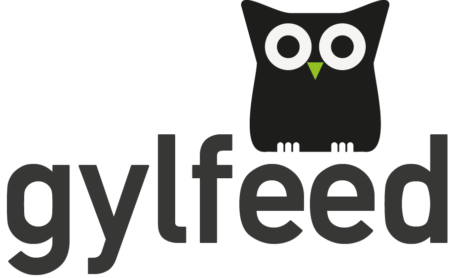

**********
Einleitung
**********

Ein privater Blog, eine Nachrichten-Webseite, oder ein Themenforum -- haben eine
Gemeinsamkeit. Sie veröffentlichen in variablen Abständen neue Inhalte. Um diese
Änderungen auf der jeweiligen Webseite mitzubekommen, muss der Nutzer im
Normalfall die Webseite aufsuchen. Bei einer großen Anzahl an Webseiten, zu der
ein Nutzer auf dem aktuellen Stand sein möchte, bedeuted dies einen großen
Zeitaufwand. Zudem aktualisieren manche Webseiten ihren Inhalt nur selten. Dem
Nutzer müsste die Möglichkeit gegeben werden, sich über die Aktualisierung einer
bestimmten Webseite automatisch informieren lassen zu können. Diese Möglichkeit
bietet sich durch das sogenannte Abonnieren von Feeds. Die jeweilige Webseite
muss diesen Service anbieten. Im Normalfall hinterlegt der Nutzer dazu eine zum
Feed gehörende URL in einer Software, die den Nutzer über Änderungen informiert,
einen sogenannten Feedreader.

Thema der Projektarbeit
=======================

Der Entwurf und die Implementierung einer eben solchen Software ist Gegenstand dieser
Projektarbeit. Der Feedreader soll minimalistisch im Aufbau und intuitiv in der
Bedienung sein. Das Bedienkonzept wird sich von dem vorhandener Feedreadern abheben.
Das Projekt wird als Open-Source-Projekt durchgeführt. Als Zielgruppe der Software
sind alle diejenigen zu nennen, die den Dienst von Feeds nutzen möchten und
hierfür eine Software mit komfortabler Bedienung, sowie ansprechender Darstellung 
der Inhalte wünschen.

Herangehensweise und Aufbau
===========================

Die Projektarbeit beschäftigt sich im Folgenden mit dem Entwurf und der
Implementierung des Feedreaders. Anfangs wird die Funktionsweise von Feeds
erläutert und Überlegungen zu daraus resultierenden Anforderungen an den
Feedreader geschildert. Das Konzept bereits vorhandener Feedreader wird 
analysiert und vorgestellt. Anschließend werden Anforderungen an den Feedreader definiert,
gefolgt von dem Entwurf der Architektur und dem Entwurf der grafischen Benutzeroberfläche.
Das Kapitel der Implementierung wird einen Einblick in die Umsetzung der
genannten Entwürfe geben.
Zum besseren Verständnis bestimmter
Sachverhalte werden Diagramme eingesetzt. Dies wird gezielt geschehen und nicht
global für alle Sachverhalte.

Zur Thematik dieser Projektarbeit wird es noch eine Bachelorarbeit geben. Die
grundsätzliche Abgrenzung zwischen Projektarbeit und Bachelorarbeit wird wie
folgt festgelegt. Die vorliegende Projektarbeit gibt einen Überblick über den
Entwurf und die Implementierung der geplanten Software. Inhalt der
Bachelorarbeit wird es sein, interne Abläufe und die eingesetzte Algorithmik
näher zu betrachten. Es wird innerhalb der Projektarbeit an den jeweiligen
Stellen darauf hingewiesen, wenn es sich um ein Thema handelt, dass in der
Bachelorarbeit ausführlicher betrachtet wird.

Titel der Software
==================

Um innerhalb der Projektarbeit die Software bei ihrem Namen nennen zu können,
soll an dieser Stelle der Titel eingeführt und kurz erläutert werden. Der Name
soll gleichermaßen die Funktionaliät der Software wiederspiegeln, als auch
sympathisch klingen. Einerseits, um beim Nutzer besser im Gedächtnis zu bleiben 
und andererseits leicht Sympathie dafür entwickeln zu können, als wär es ein bloßer technischer
Name. Auf diese Weise ist der Name *gylfeed* entstanden. Dies setzt sich aus dem
Namen einer Figur der Buchreihe "Die Legende der Wächter" (vgl. :cite:`DLW`) -- *gylfie* und *Feed*
zusammen. Für die Außendarstellung wurde ergänzend ein Logo entwickelt (siehe Abbildung :num:`gylfeedlogo` ). Dieses
Logo stellt eine Eule der Gattung Elfenkauz dar, wie es die Figur *gylfie* ist. Das Logo wird als Icon
und gemein als Logo für die Software benutzt.

.. _gylfeedlogo:

    
    Das Logo von *gylfeed*.

Für den Schriftzug wird die Schriftart *Portal* mit angepasstem Kerning verwendet. Die
Eule wurde als Vektorgrafik erstellt. Skalieren auf die passende Größe, je nach
Verwendungszweck innerhalb der Software ist somit problemlos möglich. Die
Platzierung der Eule wurde bewusst gewählt, um zwischen Schriftzug und Eule
eine Verbinung und Harmonie zu erzeugen. Hier wurde das Stilmittel des Goldenen Schnitts angewendet (vgl. :cite:`GS` - eine mathematische Herleitung)
