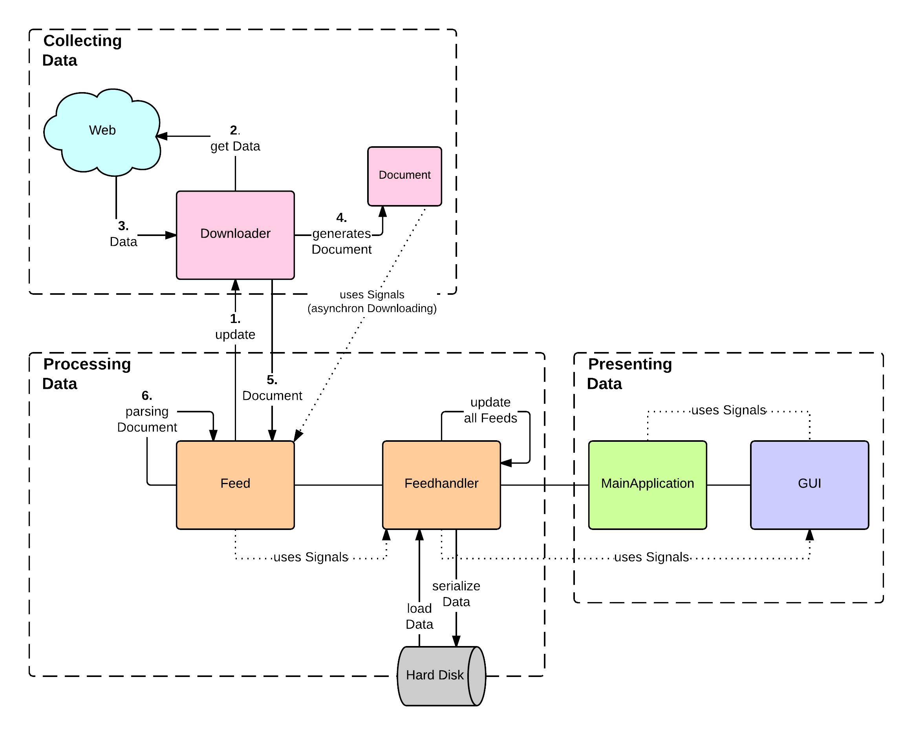

.. _ch-refs:

================================
Überblick zum Feedreader gylfeed
================================

Um zum später Zeitpunkt auf tiefergehende interne Abläufe und die Algorithmik
des Feedreaders *gylfeed* eingehen zu können, wird im Folgenden das Grundkonzept
von *gylfeed* erläutert und wesentliche Eigenschaften vorgestellt.

Entstehung und Motivation
=========================

Der Feedreader *gylfeed* ist eine Desktopanwendung, die es ermöglicht, Newsfeeds
zu abonnieren und zu verwalten. Entwickelt wurde dieser Feedreader
innerhalb der Projektarbeit *Entwurf und Implementierung eines Feedreaders*
(vgl. :cite:`SKP`). Innerhalb der Projektarbeit wurden die Anforderungen an den
Feedreader definiert, ein Entwurf der Softwarearchitektur, sowie ein Entwurf der
grafischen Benutzeroberfläche erstellt. Anschließend erfolgte die
Implementierung der Entwürfe.

Eine Analyse der bestehenden Feedreader hat ergeben, dass sich ein Großteil der
Feedreader dem klassischen Design eines Mailclients bedienen (vgl. :cite:
bestimmte Stelle). Die Motivation für den Entwurf und die Umsetzung von
*gylfeed* bestand darin, eine alternative Lösung für die Bedienung und den
Aufbau der grafischen Benutzeroberfläche zu entwickeln.

Leistungsumfang
===============

Zusammengefasst bietet der Feedreader *gylfeed* folgende Funktionalitäten:

 * Verwaltung von Feeds: Hinzufügen, Ändern, Löschen.
 * Anzeige von Feeds
 * Update der Inhalte
 * Suche nach Inhalten
 * Eingebetteter Webbrowser

Grundkonzept von *gylfeed*
==========================

In Abbildung :num:`funktionsprinzip` ist das Grundkonzept von *gylfeed* dargestellt.

.. _funktionsprinzip:

    
    Funktionsprinzip von *gylfeed*.

