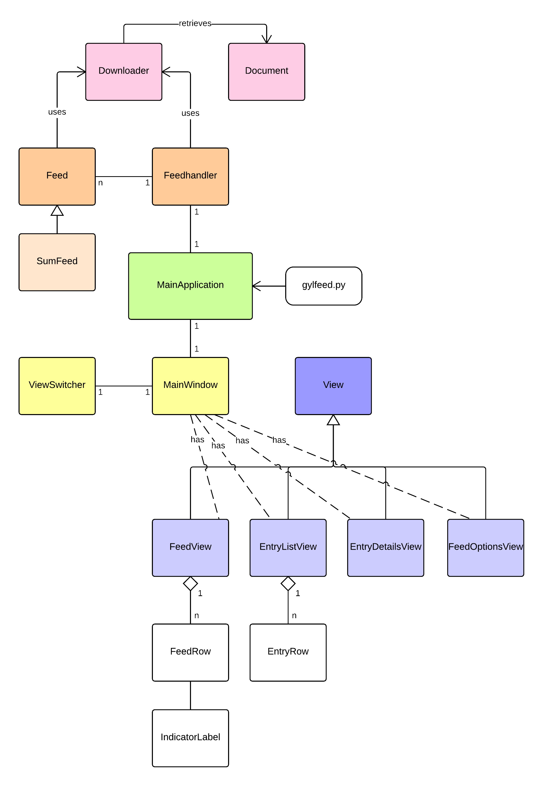
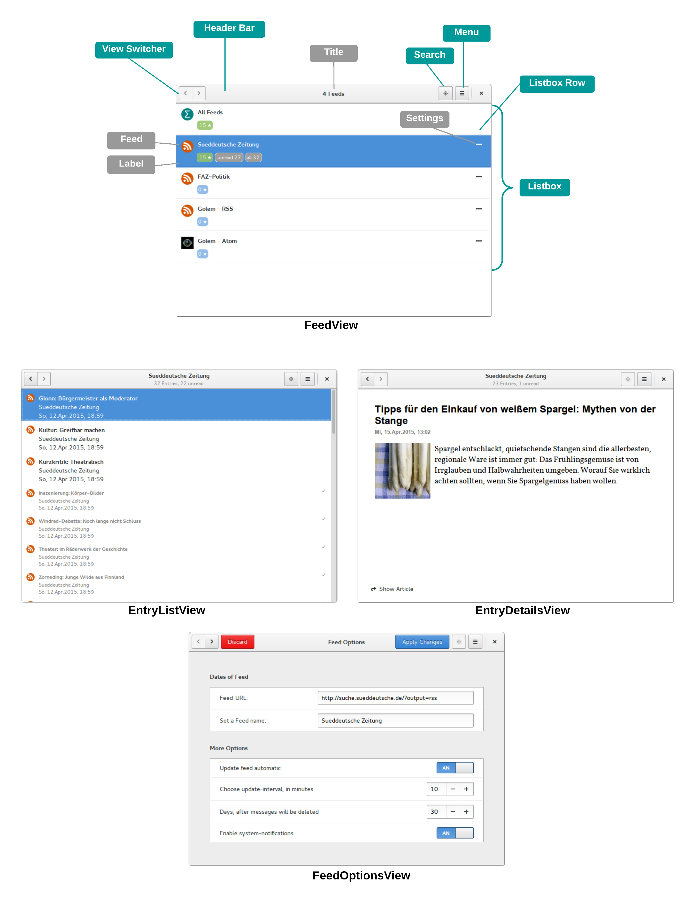

.. _ch-refs:

================================
Überblick zum Feedreader gylfeed
================================

Um zu einem späteren Zeitpunkt auf tiefergehende interne Abläufe und die Theorie
des Feedreaders *gylfeed* eingehen zu können, werden im Folgenden das Grundkonzept
und wesentliche Eigenschaften von *gylfeed* erläutert.

Entstehung und Motivation
=========================

Der Feedreader *gylfeed* ist eine Desktopanwendung, die es ermöglicht, Newsfeeds
zu abonnieren und zu verwalten. Entwickelt wurde dieser Feedreader
innerhalb der Projektarbeit *Entwurf und Implementierung eines Feedreaders*
(vgl. :cite:`kiessling`). Innerhalb der Projektarbeit wurden die Anforderungen an den
Feedreader definiert, ein Entwurf der Softwarearchitektur, sowie ein Entwurf der
grafischen Benutzeroberfläche erstellt. Anschließend erfolgte die
Implementierung der Entwürfe.

Eine Analyse der bestehenden Feedreader hat ergeben, dass sich ein Großteil der
Feedreader dem klassischen Design eines Mailclients bedienen (vgl.
:cite:`kiessling`
S.9). Die Motivation für den Entwurf und die Umsetzung von
*gylfeed* bestand darin, einerseits eine alternative Lösung für den
Aufbau der grafischen Benutzeroberfläche zu entwickeln und andererseits eine
komfortable Bedienung anzubieten.

Leistungsumfang
===============

Zusammengefasst bietet der Feedreader *gylfeed* folgende Funktionalitäten:

 * Verwaltung von Feeds: Hinzufügen, Ändern und Löschen eines Feeds.
 * Optionen für Feeds: Update-Intervall, Notifications und automatisches Löschen
   von Entries nach X Tagen.
 * Update von Feeds: Manuelles und automatisches Update.
 * Suche nach Feeds und Nachrichten-Titeln
 * Eingebetteter Webbrowser
 * Bedienkonzept: Navigation mit Tastatur und Einbindung von Shortcuts.

Für die grafische Benutzeroberfläche wurden folgende Anforderungen umgesetzt:
 
 * Entwicklung nach GNOME Design-Richtlinien
 * Minimalistisches Design
 * Kompaktheit
 * Innovatives Navigationskonzept
 * Ausreichend Feedback an den Nutzer geben
 * Darstellung der Funktionalitäten

Eine ausführlichere Beschreibung der Funktionalitäten und Anforderungen an die
grafische Benutzeroberfläche ist in der
Projektarbeit in Kapitel *4 -- Anforderungen an die Software* zu finden.
 
Implementierung
===============

Die Umsetzung von *gylfeed* erfolgte mit der Programmiersprache Python in der
Version 3.3. Die grafische Benutzeroberfläche wurde mit GTK3, dem GIMP Toolkit,
umgesetzt.

Es wurden die in Abbildung :num:`klassendiagramm` dargestellten Klassen
implementiert.

.. _klassendiagramm:

    
    Klassenübersicht von *gylfeed*.

Grundkonzept von *gylfeed*
==========================

In Abbildung :num:`funktionsprinzip` ist das Funktionsprinzip von *gylfeed*
dargestellt. Anhand dieser Darstellung soll der 
Aufbau und die Abläufe innerhalb des Feedreaders erläutert werden.

.. _funktionsprinzip:

.. figure:: ./figs/funktionsprinzip.png
    :alt: Funktionsprinzip von gylfeed.
    :width: 100%
    :align: center
    
    Funktionsprinzip von *gylfeed*.

Das Konzept ist in die Bereiche Beschaffung der Daten (Collecting Data),
Verarbeitung der Daten (Processing Data) und Darstellung der Daten (Presenting
Data) aufgeteilt. Die Bachelorarbeit wird in den folgenden Kapiteln auf
Einzelheiten dieser Bereiche eingehen.

An dieser Stelle soll der Grobablauf des Feedreaders erläutert werden.
Die Nummerierungen der Aktionen dienen zur Orientierung und werden dazu
verwendet, um mit der Beschreibung des Diagramms zu beginnen.

Es wird angenommen, im Objekt Feed wird gefordert ein Update durchzuführen (1).
Dieser Auftrag wird an den Downloader weitergegeben. Dieser lädt die angefragten
Daten aus dem Web herunter (2). An dieser Stelle ist anzumerken, dass hier nicht
immer die kompletten Daten des Feeds heruntergeladen werden. Lässt es
die Struktur des betreffenden Feeds zu, wird nur dann ein kompletter Download
der Daten des Feeds durchgeführt, wenn sich diese tatsächlich geändert haben.
Näheres hierzu wird in Abschnitt :ref:`etagtest` betrachtet.

Im nächsten Schritt empfängt der Downloader die Daten aus dem Web (3). 
Document wird vom Downloader als Future-Objekt verwendet (4).
Die Instanz des Documents wird an den Feed zur weiteren
Verarbeitung gegeben (5). Das Weiterverarbeiten im Feed wird dadurch ausgelöst,
indem sich der Feed auf ein Signal von der Instanz Document registriert. Sobald
das Document komplett heruntergeladen ist, wird das entsprechende Signal
ausgelöst und die im Document enthaltenen Daten werden im Feed geparst (6).

Der Feed kommuniziert an den Feedhandler, dass er sich aktualisiert hat. Der
Feedhandler reicht das Signal an die Benutzeroberfläche weiter. Die Änderungen
werden grafisch dargestellt.

Im Feedhandler werden Updates ausgelöst, die manuell vom Benutzer angefordert
werden. Da dies für alle Feeds geschieht, ist es die Aufgabe des Feedhandlers, der
als Verwalter der Feeds funktioniert. Er lässt für jeden Feed eine
Aktualisierung durchführen. Die Aktualisierung im Feed selbst entspricht dem
Ablauf von den genannten Schritten (1) bis (6). Eine weitere Aufgabe des
Feedhandlers ist die persistente Speicherung der Daten, sowie das Laden dieser
Daten beim Start der Software.

Die Benutzeroberfläche kommuniziert Eingaben des Benutzers unter der Verwendung von
Signalen an die jeweilige logische Einheit. Die theoretischen Grundlagen zu
Signalen und die Verwendung von Signalen innerhalb *gylfeed* wird in Kapitel
:ref:`signal_kommunikation` -- Kommunikation über Signale betrachtet. 

Die grafische Benutzeroberfläche
================================

Ein großer Anteil der Entwicklung von *gylfeed* betraf den Entwurf und die
Implementierung der grafischen Benutzeroberfläche. Die verschiedenen Ansichten
sind zusammengefasst in der Abbildung :num:`guioverview` zu sehen.

Die Funktionalitäten der einzelnen Ansichten zusammengefasst:

**FeedView**: Die FeedView beinhaltet alle bisher abonnierten Feeds. Es ist
möglich über den Button *Settings* Einstellungen für den Feed vorzunehmen oder
den Feed zu löschen. Für jeden Feed wird angezeigt, wieviele neue, ungelesene,
gesamten Nachrichten der Feed hat.

**EntryListView**: In der EntryListView werden alle Nachrichten eines
ausgewählten Feeds in Listenform angezeigt.

**EntryDetailsView**: Die EntryDetailsView zeigt eine bestimmte Nachricht im
Detail an. Es wird der Titel, Zeitstempel der Nachricht und der Plot der
Nachricht angezeigt. Falls die Nachricht Bildmaterial enthält, wird dieses
ebenfalls dargestellt. Innerhalb dieser Ansicht ist es möglich, die
Ursprungsmeldung der jeweiligen Nachricht in einem eingebetteten Browser
anzeigen zu lassen.

**FeedOptionsView**: Diese Ansicht enthält neben den Daten zum Feed sämtliche
Einstellungen, die gesetzt werden können. Die Daten sind die URL und der Name
des Feeds. Mögliche Einstellungen sind:

 * Automatisches Update
 * Update-Intervall
 * Löschen von Nachrichten nach X Tagen
 * Notifications bei neuen Nachrichten

.. _guioverview:

    
    Grafische Benutzeroberfläche von *gylfeed*. Beginnend mit der Ansicht
    FeedView, gefolgt von den Ansichten EntryListView, EntryDetailsView und
    FeedOptionsView.

