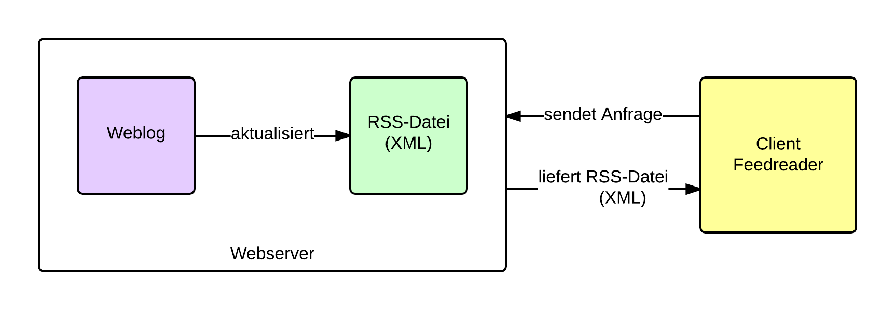

.. _ch-refs:

======================
Grundlegendes zu Feeds
======================

Newsfeeds bedienen sich verschiedener Formate, um ihre Daten zu veröffentlichen.
Im Folgenden sollen die verschiedenen Formate aufgezeigt und kurz erläutert
werden. Weiterhin soll ein Grundverständnis für die Funktionsweise von Feeds
geschaffen werden. Tierfergehende Informationen über die Entwicklung der
einzelnen Formate seit Einführung ist Bestandteil der Bachelorarbeit. An dieser
Stelle soll lediglich ein kurzer Überblick gegeben werden.

Funktionsweise und Einsatzzwecke von Feeds
==========================================

Heinz Wittenbrink schreibt in *Newsfeeds mit RSS und Atom* (siehe :cite:`newsfeeds` ),
Newsfeeds, oder auch Feeds genannt, sind Dokumente, die in den Formaten RSS
oder Atom erstellt werden. Wittenbrink nennt vier Einsatzszenarien: 
 
 * Weblogs
 * Publizieren von Metadaten
 * Aggregieren und Archivieren von Newsfeeds
 * Asynchrones Broadcasting

Anzumerken ist, dass neben RSS und Atom weitere Formate, wie z.B. Scripting
News, OPML oder NewsML entwickelt wurden (siehe :cite:`FU` - Übersicht Formate).
Im Weiteren wird das Hauptaugenmerk auf den Formaten RSS und Atom liegen.

Bevor auf die Formate näher eingegangen wird, soll nun die Funktionsweise von
Feeds näher erläutert werden. Als Beispiel soll das Abonnieren eines Feeds,
der von einem Weblog veröffentlicht wird, dienen. Hierzu bietet der Weblog eine
XML-Datei an, die über eine URL abrufbar ist. Auf die Möglichkeit, dass dieser
Weblog das Abonnieren eines Feeds anbietet, wird der Benutzer meist
durch einen Button mit Feed-Icon (siehe Abbildung :num:`rsslogo`) oder einen gesonderte Link
hingewiesen. Die URL kann anschließend entweder in einen Feedreader eingetragen 
oder direkt durch den Browser dargestellt werden. Bei einem Feedreader handelt
es sich um eine Desktop-Anwendung, die den Vorteil gegenüber Browsern bietet,
dass sie zumeist ansprechender in der Darstellung der Inhalte ist. Außerdem ist
es dem Benutzer beispielsweise möglich, Inhalte zu speichern und dadurch im
Offline-Modus zu lesen. Auch die Suche innerhalb der gespeicherten Inhalte ist möglich.

.. _rsslogo:

.. figure:: ./figs/rss_logo.png
    :alt: Icon für Feeds.
    :width: 10%
    :align: center
    
    Das Icon für Feeds, ursprünglich für RSS-Feeds.

In Abbildung :num:`funktionsweise` ist die grundlegende Funktionsweise von Feeds
dargestellt. Erstellt der Weblog neue Inhalte, werden die Inhalte der XML-Datei
hinzugefügt und über einen Link bereitgestellt. Das Erstellen der XML-Datei
wird bei Weblogs häufig als automatische Funktion zur Verfügung gestellt. 
Durch die Aktualisierung des Weblogs wird die XML-Datei automatisch akualisiert.
Der Feedreader auf einem Client-PC fragt in regelmäßigen
Abständen beim Webserver an und holt sich die aktualisierte XML-Datei.
Anschließend verarbeitet der Feedreader die XML-Datei und zeigt dem Benutzer die
Inhalte an. Hier wird nochmals deutlich, dass die Initiative vom Client ausgeht.
Der Client fragt aktiv beim Webserver nach.

.. _funktionsweise:

    
    Die Funktionsweise von Feeds.

Die XML-Datei enthält reines XML ohne jegliche Zusätze, wie z.B. Layoutangaben.
Im Folgenden ist eine solche XML-Datei für die RSS-Version 2.0 abgebildet.

.. code-block:: xml

    <?xml version="1.0" encoding="utf-8"?>
 
    <rss version="2.0">
        <channel>
            <title>Titel des Feeds</title>
            <link>URL der Webpräsenz</link>
            <description>Kurze Beschreibung des Feeds</description>
            <language>Sprache des Feeds</language>
            <copyright>Autor des Feeds</copyright>
            <pubDate>Erstellungsdatum</pubDate>
            <image>
                <url>URL einer einzubindenden Grafik</url>
                <title>Bildtitel</title>
                <link>URL, mit der das Bild verknüpft ist</link>
            </image>
 
            <item>
                <title>Titel des Eintrags</title>
                <description>Kurze Zusammenfassung des Eintrags</description>
                <link>Link zum vollständigen Eintrag</link>
                <author>Autor des Artikels, E-Mail-Adresse</author>
                <guid>Eindeutige Identifikation des Eintrages</guid>
                <pubDate>Datum des Items</pubDate>
            </item>
       </channel>
    </rss>

   

Der RSS-Block enthält verschiedene Einträge. Zum einen das Element *<channel>*,
dass die kompletten Informationen über Feed und dessen einzelnen Einträge
beinhaltet. Darauf folgen die Elemente *<title>*, *<link>*, *<description>*,
*<language>*, *<copyright>*, *<pubDate>* und *<image>*. Diese Elemente
beschreiben den Feed, sozusagen den Herausgeber. Im Anschluss sind die einzelnen *items* aufgeführt. Ein
*item* steht für einen Eintrag auf der eigentlichen Webseite. Ein *channel* kann
mehrere *item*-Blöcke enthalten. Das *item* im dargestellten Fall hat die Elemente *<title>*,
*<description>*, *<link>*, *<author>*, *<guid>*, und *<pubDate>*. Diese Elemente
beschreiben das einzelne *item*. Nicht alle dieser Elemente sind zwingend
erforderlich um eine valide RSS-Datei zu generieren. Es gibt zwingend
erforderliche und optionale Elemente. Auf diese Thematik wird im Verlauf noch
eingegangen.

Ziele:

Vorteile:

Formate zur *Content Syndication*
=================================

Neben RSS, als meistegenutzes Format bei Feeds, hat sich das Format Atom
etabliert. Bevor diese beiden Formate näher betrachtet werden, soll der Begriff
*Content Syndication* erklärt werden. Heinz Wittenbrink definiert *Content
Syndication* in *Newsfeeds mit RSS und Atom* (siehe :cite:`newsfeeds`) als Fachausdruck 
für den regelmäßigen Austausch aktueller Informationen zwischen Webseiten. Er
weisst außerdem darauf hin, dass die Spezifikation von RSS 2.0 (siehe :cite:`2.0SPEC`) Syndikation als das 
"online Zugänglichmachen von Daten für weitere Übertragung, Aggregierung und Online-Publikation"
definiert.

Das Format RSS
---------------
Die erste Version von RSS, RSS 0.90, wurde 1997 von Netscape entwickelt. 
Zu dieser Zeit trug RSS die Bedeutung *Rich Side Summary*. Es
folgten die Versionen 0.91, 0.92, 0.93 und 1.0. Im Jahr 2003 wurde von Harvard
die Version 2.0 veröffentlicht. Die Version 2.0 basiert nicht, wie zu vermuten
wäre, auf der Version 1.0, sondern auf der Version 0.92 (siehe :cite:`HU` - Versionsübersicht von Harvard).
Im Laufe dieser Entwicklungen wurde *Really Simple Syndication* als Bedeutung für der Abkürzung RSS eingeführt.
Die einzelnen Versionen unterscheiden sich darin, dass Attribute neu
hinzugefügt, oder auch in späteren Versionen wieder entfernt wurden. Mit den
detaillierten Unterschieden wird sich die Bachelorarbeit beschäftigen.

RSS basiert auf XML und muss deshalb konform mit den XML 1.0 Richtlinien sein.
Für RSS selbst gibt es Mindestanforderungen. Für das *channel* Attribut sind
das:
 
 * *title*
 * *link*
 * *description*
 
Alle anderen Attribute, wie beispielsweise *language* oder *pubdate* sind
optional.

Für das Attribut *item* gibt es keine Mindestanforderungen, es sollte aber
mindestens *title* oder *discription* vorhanden sein.

Das Format Atom
---------------

Atom ist ebenso wie RSS ein plattformunabhängiger XML-Standard zum Austausch von
Informationen (siehe :cite:`WIA`). Entwickelt wurde es 2005 von Mark Nottingham
und Richard Sayre. Es liegt aktuell in der Version 1.0 vor (siehe
:cite:`ASP` - Spezifikation von Atom). Die Spezifikation von Atom erwähnt als
primäre Verwendung des Formats den Austausch von Webinhalten, wie z.B. Weblogs 
und Nachrichten, innerhalb des Webs und an den Endanwender. Ziel von Atom war
es, die Vorteile der verschiedenen RSS-Versionen zu vereinen und dazu ergänzende
Elemente hinzuzufügen. Um die Unterschiede zu RSS besser nachvollziehen zu
können, soll das XML von einem beispielhaften Atom-Feed betrachtet werden:

.. code-block:: xml

    <?xml version="1.0" encoding="utf-8"?>
        <feed xmlns="http://www.w3.org/2005/Atom">
            <title type="text">Title of Feed</title>
            <subtitle type="html">Subtitle of Feed</subtitle>
            <icon>"http://..."</icon>
            <logo>"http://..." </logo>
            <updated>2005-07-31T12:29:29Z</updated>
            <id>tag:example.org,2003:3</id>
            <link rel="alternate" type="text/html"
            hreflang="en" href="http://example.org/"/>
            <link rel="self" type="application/atom+xml"
            href="http://example.org/feed.atom"/>
            <rights>Copyright (c)</rights>
            <generator uri="http://www.example.com/" version="1.0">
            Example Toolkit
            </generator>
        <entry>
            <title>Title of Entry</title>
            
 Summary of Entry

            <link rel="alternate" type="text/html"
            href="http://example.org/2005/04/02/atom"/>
            <link rel="enclosure" type="audio/mpeg" length="1337"
            href="http://example.org/audio/ph34r_my_podcast.mp3"/>
            <id>tag:example.org,2003:3.2397</id>
            <updated>2005-07-31T12:29:29Z</updated>
            <published>2003-12-13T08:29:29-04:00</published>
            <author>
                <name>Name of Author</name>
                <uri>http://example.org/</uri>
                <email>author@example.com</email>
            </author>
            <contributor>
                <name>Name of Contributor</name>
            </contributor>
            <content type="xhtml" xml:lang="en"
            xml:base="http://example.org/">
            

            
<i>[Update: The Atom draft is finished.]</i>

            

           </content>
        </entry>
        </feed>

Folgende Hauptunterschiede zwischen dem Aufbau einer Atom- und RSS-Datei sind anhand des Code-Beispiels
zu nennen:

 * Anstatt dem umschließenden Element *channel* wird *feed* verwendet.
 * Innerhalb des Elements *feed* gibt es *entries*, anstatt *items*.
 * Für das RSS-Element *image* gibt es bei Atom die Unterscheidung *icon* und *logo*.
 * Ein Entry kann auch andere Inhaltstypen als reinen Text beinhalten. Im
   Beispiel wäre dies das Element *content*, das XHTML-Elemente enthält.
 * Sowohl *feed* als auch *entry* können mehrere Links enthalten, die unterschiedliche Aufgaben haben.
 

Fazit für die Entwicklung von gylfeed
=====================================

An dieser Stelle wird bereits deutlich, dass die Vielzahl an unterschiedlichen
Versionen, allein bei RSS, für die Planung und Entwicklung von *gylfeed* von
Bedeutung sein werden. Zusätzlich stellt die Tatsache, dass es bei RSS relativ wenige
Mindestanforderungen hinsichtlich der Attribute gibt, eine Herausforderung für
die Verarbeitung der Daten dar. Außerdem muss berücksichtigt werden, dass es
beispielsweise zwischen RSS und Atom grundsätzliche Unterschiede gibt. Die
Verarbeitung der Daten eines RSS-Feeds werden anders als die eines Atom-Feeds zu
behandeln sein.

