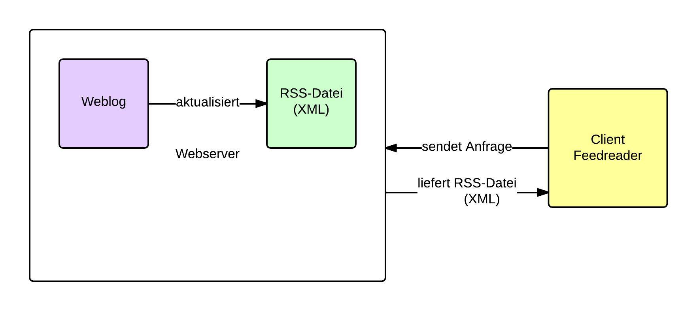

.. _ch-refs:

======================
Grundlegendes zu Feeds
======================

Newsfeeds bedienen sich verschiedener Formate, um ihre Daten zu veröffentlichen.
Im Folgenden sollen die verschiedenen Formate aufgezeigt und kurz erläutert
werden. Weiterhin soll ein Grundverständnis für die Funktionsweise von Feeds
geschaffen werden. Tierfergehende Informationen über die Entwicklung der
einzelnen Formate seit Einführung ist Bestandteil der Bachelorarbeit. An dieser
Stelle soll lediglich ein kurzer Überblick gegeben werden.

Funktionsweise und Einsatzzwecke von Feeds
==========================================

Heinz Wittenbrink schreibt in *Newsfeeds mit RSS und Atom* (siehe :cite:`newsfeeds` ),
Newsfeeds, oder auch Feeds genannt, sind Dokumente, die in den Formaten RSS
oder Atom erstellt werden. Wittenbrink nennt vier Einsatzszenarien: 
 
 * Weblogs
 * Publizieren von Metadaten
 * Aggregieren und Archivieren von Newsfeeds
 * Asynchrones Broadcasting

Anzumerken ist, dass neben RSS und Atom weitere Formate, wie z.B. Scripting
News, OPML oder NewsML entwickelt wurden (siehe :cite:`FU` - Übersicht Formate).
Im Weiteren wird das Hauptaugenmerk auf den Formaten RSS und Atom liegen.

Bevor auf die Formate näher eingegangen wird, soll nun die Funktionsweise von
Feeds näher erläutert werden. Als Beispiel soll das Abonieren eines Feeds,
der von einem Weblog veröffentlicht wird, dienen. Hierzu bietet der Weblog eine
XML-Datei an, die über eine URL abrufbar ist. Auf die Möglichkeit, dass dieser
Weblog das Abonieren eines Feeds anbietet, wird der Benutzer meist
durch einen Button mit Feed-Icon (siehe Abbildung :num:`rsslogo`) oder einen gesonderte Link
hingewiesen. Die URL kann anschließend entweder in einen Feedreader eingetragen 
oder direkt durch den Browser dargestellt werden. Bei einem Feedreader handelt
es sich um eine Desktop-Anwendung, die den Vorteil gegenüber Browsern bietet,
dass sie zumeist ansprechender in der Darstellung der Inhalte ist. Außerdem ist
es dem Benutzer beispielsweise möglich, Inhalte zu speichern und dadurch im
Offline-Modus zu lesen. Auch die Suche innerhalb der Inhalte ist möglich.

In Abbildung :num:`funktionsweise` ist dargestellt, wie die grundlegende
Funktionsweise von Feedreader und Weblog ist.

.. _funktionsweise:

    
    Funktionsweise von Feedreader und Weblog.

.. _rsslogo:

    
    Das Icon für Feeds, ursprünglich für RSS-Feeds.

Die XML-Datei enthält reines XML ohne jegliche Zusätze, wie z.B. Layoutangaben.
Im Folgenden ist eine solche XML-Datei für die RSS-Version 2.0 abgebildet.

.. code-block:: xml

    <?xml version="1.0" encoding="utf-8"?>
 
    <rss version="2.0">
        <channel>
            <title>Titel des Feeds</title>
            <link>URL der Webpräsenz</link>
            <description>Kurze Beschreibung des Feeds</description>
            <language>Sprache des Feeds</language>
            <copyright>Autor des Feeds</copyright>
            <pubDate>Erstellungsdatum</pubDate>
            <image>
                <url>URL einer einzubindenden Grafik</url>
                <title>Bildtitel</title>
                <link>URL, mit der das Bild verknüpft ist</link>
            </image>
 
            <item>
                <title>Titel des Eintrags</title>
                <description>Kurze Zusammenfassung des Eintrags</description>
                <link>Link zum vollständigen Eintrag</link>
                <author>Autor des Artikels, E-Mail-Adresse</author>
                <guid>Eindeutige Identifikation des Eintrages</guid>
                <pubDate>Datum des Items</pubDate>
            </item>
       </channel>
    </rss>

   

Ziele:

Vorteile:

Aktuelle Formate
================

Neben RSS, als meistegenutzes Format bei Feeds, hat sich das Format Atom
durchgesetzt. Im Weiteren werden die beiden genannten Formate betrachtet.

Das Format RSS
---------------
Die erste Version von RSS, RSS 0.90, wurde 1997 von Netscape entwickelt. 
Zu dieser Zeit trug RSS die Bedeutung *Rich Side Summary*. Es
folgten die Versionen 0.91, 0.92, 0.93 und 1.0. Im Jahr 2003 wurde von Harvard
die Version 2.0 veröffentlicht. Die Version 2.0 basiert nicht, wie zu vermuten
wäre, auf der Version 1.0, sondern auf der Version 0.92 (siehe :cite:`HU` - Versionsübersicht von Harvard).
Im Laufe dieser Entwicklungen wurde *Really Simple Syndication* als Bedeutung für der Abkürzung RSS eingeführt.

RSS basiert auf XML und muss deshalb konform mit den XML 1.0 Richtlinien sein.

Das Format Atom
---------------

Fazit für die Entwicklung von gylfeed
-------------------------------------
An dieser Stelle wird bereits deutlich, dass die Vielzahl an unterschiedlichen
Versionen, allein bei RSS, für die Planung und Entwicklung von *gylfeed* von
Bedeutung sein werden.

