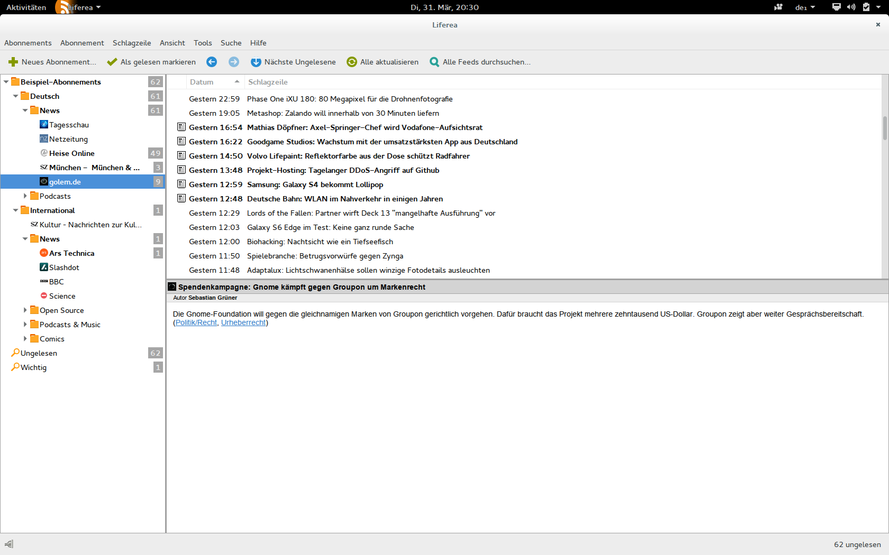

*********************
Vorhandene Feedreader
*********************

Um einen Eindruck von bereits vorhandenen Feedreadern zu erhalten und
anschließende Designentscheidungen bei *gylfeed* besser nachvollziehen zu
können, wird das Grundkonzept dieser Feedreader kurz vorgestellt. Eine genaue
Analyse der einzelnen Funktionalitäten, die von den Feedreadern bereitgestellt
werden und weiterführende Vergleiche, sind Bestandteil der Bachelorarbeit.

Konzept aktueller Feedreader
============================
Der Großteil der vorhandenen Feedreader, in diesem Fall speziell Feedreader, die
als eigenständige Desktopsoftware funktionieren, sind an den Aufbau eines
Mailclients angelehnt.
Als Veranschaulichung wird der Feedreader *Liferea* herangezogen. *Liferea*
deshalb, weil er wie es *gylfeed* sein wird:

 * für Linux entwickelt wird
 * Gtk als Oberflächentechnik verwendet
 * unter GNU GPL lizenziert ist
 * als übersichtlich und leicht zu bedienen gilt

.. _liferea:

    
    Der Feedreader liferea.

Fazit für die Entwicklung von *gylfeed*
=======================================

