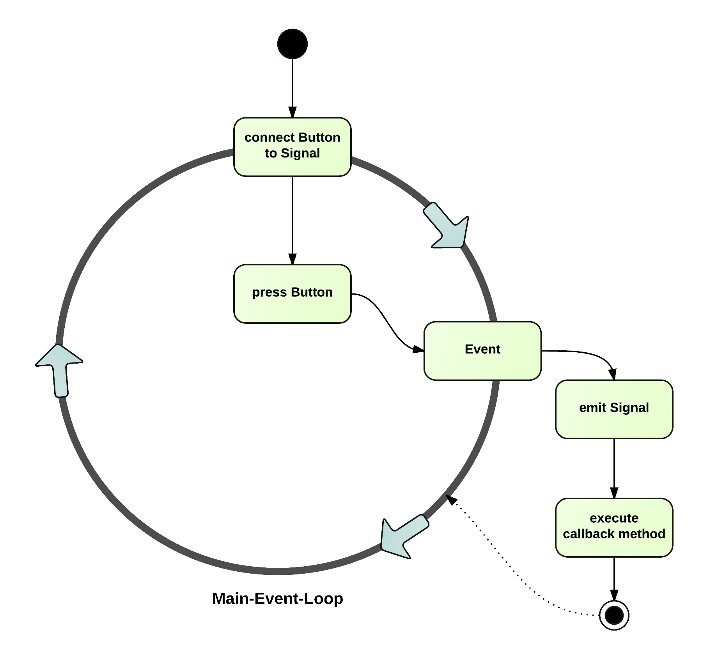
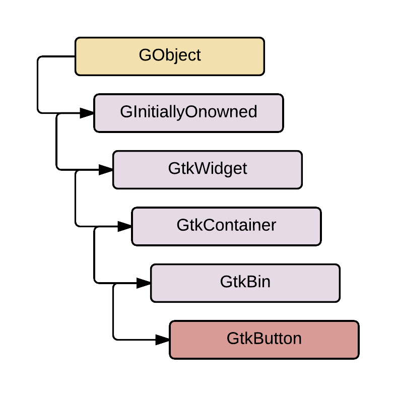
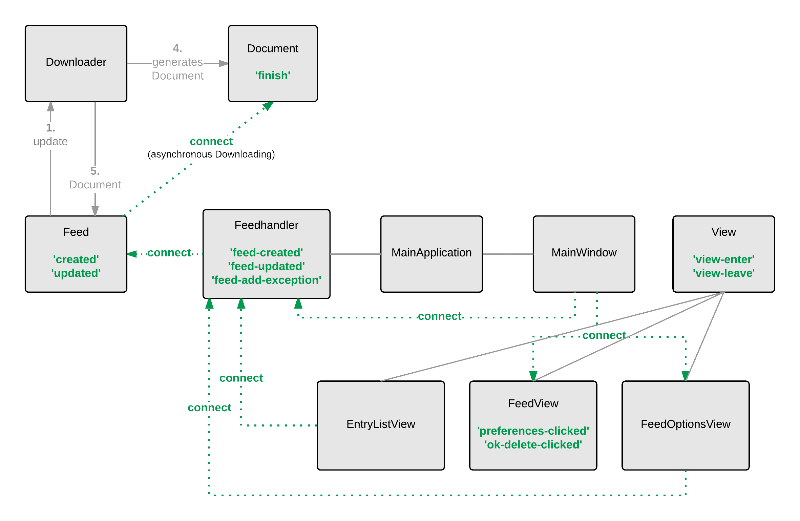

.. _signal_kommunikation:

**************************
Kommunikation über Signale
**************************

Signale werden innerhalb von *gylfeed* einerseits verwendet, um Interaktionen vom Benutzer
zu erkennen und weiterzuleiten. Andererseits werden Signale für interne Abläufe
verwendet. An dieser Stelle sollen die Hintergründe und theoretischen Grundlagen zu
Signalen näher betrachtet und die Anwendung innerhalb von *gylfeed* erläutert
werden.

GTK+ als Grundlage
==================

GTK+, das GIMP Toolkit, ist eine Bibliothek zur Erstellung grafischer
Benutzeroberflächen. Es bietet die Grundlage für die Verwendung von Signalen.
GTK+
wurde ursprünglich für das GNU Image Manipulation Programm (GIMP) entwickelt
(vgl. :cite:`gimp` -- offizielle Webseite von GIMP).
Dieser Ursprung blieb im Namen von GTK+ enthalten. Zwischenzeitlich wurde die
dritte Version von GTK+ entwickelt. GTK+ ist plattformübergreifend und unter der 
LGPL (GNU Lesser General Public License) lizenziert (vgl. :cite:`lgpl`).

Entwickelt wurde GTK+ in der Programmiersprache C. Language Bindings ermöglichen
es jedoch auch in anderen Programmiersprachen mit GTK+ zu entwickeln. Dazu zählen bespielsweise
Python, Perl, JavaScript oder C++ (vgl.
:cite:`language` -- Language Bindings für GTK+).

GTK+ basiert zu einem großen Teil auf der Bibliothek *GLib*. *GLib* stellt
beispielsweise Datenstrukturen zur Verfügung oder bietet einen Eventloop an.
Die Bibliothek *GObject* ist wiederum Teil von *GLib* und ermöglicht innerhalb
C die objektorientierte Programmierung. Außerdem ermöglicht *GLib* eine eventbasierte Programmierung,
die beispielsweise für grafische Benutzeroberflächen eingesetzt wird.

Grafische Benutzeroberflächen, die mit GTK+ erstellt werden, bestehen aus
sogenannten Widgets. Ein Widget ist ein Element der grafischen
Benutzeroberfläche, das die Interaktion zwischen Benutzer und Software ermöglicht. Widgets sind
beispielsweise Buttons, Eingabefelder, Fortschrittsbalken oder ein einfaches
Label. Eine Übersicht dieser Widgets ist in der Online-Dokumentation von GTK+ zu
finden (vgl. :cite:`widgets` -- Widget-Gallerie von GTK+). Diese Widgets sind in
einer Hierarchie organisiert. Die Hierarchie
aller Widgets ist unter :cite:`widgetsall` abrufbar.

.. _maineventloop:

Der Main-Event-Loop
===================

Wenn es darum geht, verschiedene Events abzufangen, die jederzeit auftreten können und nicht
im Voraus geplant sind, ist der Main-Event-Loop im Zusammenspiel mit Signalen
interessant.
Um das Zusammenspiel von Main-Event-Loop und Signalen besser nachvollziehen zu können,
wurde der Ablauf in Abbildung :num:`mainloop` grafisch dargestellt.

.. _mainloop:

    
    Main-Event-Loop im Zusammenspiel mit Signalen.

    
GTK+ verwendet ein eventbasiertes Konzept. Mit Hilfe der Abbildung
:num:`mainloop` soll dieses Konzept erläutert werden. Der *Main-Event-Loop* ist
in wartender Stellung und prüft zyklisch, ob ein Event aufgetreten ist. In
Zusammenspiel mit Signalen sieht ein typischer Ablauf eines Klicks auf einen
Button wie folgt aus. Unabhängig vom Abfangen und Weitergeben des
Events muss der Button zuvor mit einem Signal verbunden werden. Signale werden durch Strings
repräsentiert. Für das Klicken eines Buttons ist *clicked* der zugehörige
Signalname,
mit dem sich verbunden werden muss. Gleichzeitig muss beim Verbinden auf ein
Signal eine Funktion angegeben werden, die beim Auslösen des Signals ausgeführt
wird -- eine sogenannte Callback-Funktion. Zu einem beliebigen Zeitpunkt wird
nun der Button angeklickt. Dies löst ein Event aus, das von dem
*Main-Event-Loop* abgefangen wird und an das jeweilige Widget, hier der Button,
weitergegeben wird. Empfängt der Button das Event, wird das Signal *clicked*
ausgelöst (emittiert) und die hinterlegte Callback-Funktion ausgeführt. Ist die
Callback-Funktion ausgeführt, kehrt GTK+ wieder zum *Main-Event-Loop* zurück und
es wird gewartet, bis das nächste Event auftritt.

Einsatz von Signalen
====================

Widgets wie beispielsweise *Gtk.Button* bieten bereits Signale an, mit denen das
jeweilige Widget verbunden werden kann. Außerdem bietet GTK+ die Möglichkeit,
eigene Signale zu definieren. Beide Varianten werden nun näher betrachtet.

Widgets und Signale
-------------------

Als Beispiel soll weiterhin der *Gtk.Button* dienen. Für den *Gtk.Button* werden
unter anderem folgende Signale angeboten:

 * *activate*
 * *clicked*

Folgendes Code-Beispiel zeigt das Verbinden mit dem Signal *clicked* und die
Hinterlegung der Callback-Funktion:

.. code-block:: python

    from gi.repository import Gtk

    # Callback-Funktion  
    def print_hello(button):
        print("Hello")

    button = Gtk.Button("Print Hello")          # Erstellen eines Buttons
    button.connect('clicked', print_hello)      # Verknüpfen mit Signal 'clicked'
                                                # und Angabe der Callback-Funktion

    window = Gtk.Window()                       # Erstellen eines Fensters
    window.add(button)                          # Hinzufügen von Button zu Fenster
    window.show_all()                           # Alle Bestandteile von window anzeigen

    Gtk.main()                                  # Gtk Main-Loop

.. _widgethierarchie:

    
    Die Hierarchie von GObject bis GtkButton.

Eigene Signale
--------------

Wie bereits erwähnt können nicht nur bereits vorhandene Signale verwendet werden. 
Die Definition eigener Signale ist möglich. Hierzu ist es notwendig, dass die Instanz, die ein
Signal anbieten möchte, von GObject.GObject ableitet. Im Falle des *Gtk.Button*
ist dies bereits aufgrund der vorliegenden Hierarchie gegeben (siehe Abbildung
:num:`widgethierarchie`). Für die Definition von eigenen Signalen muss die
Ableitung von GObject.GObject nachgeholt werden.

Ein neues Signal kann folgendermaßen definiert werden:

.. code-block:: python

        __gsignals__ = {'new-signal': (GObject.SIGNAL_RUN_FIRST, None, (int,))}

Es wird ein Python-Dictionary mit dem Signalnamen *new-signal* als Schlüssel angelegt. Dem
zugeordnet sind folgende Werte: Der Zeitpunkt der Ausführung des Objekt-Handlers,
ein möglicher Rückgabewert und Übergabeparameter. Im Codebeispiel ist als
Zeitpunkt der Ausführung *GObject.SIGNAL_RUN_FIRST* angegeben. Als Rückgabewert ist
*None* angegeben, d.h. die Callback-Funktion hat keinen Rückgabewert. Als
Übergabeparameter ist *int* angegeben, d.h. die Callback-Funktion erwartet einen
Integer-Wert. 

Der gesamte Code mit Ableitung der Instanz, für die ein neues Signal erstellt
wird und Definition der Callback-Funktion sieht folgendermaßen aus:

.. code-block:: python
 
   class NewObject(GObject.GObject):
        __gsignals__ = {
                'new-signal': (GObject.SIGNAL_RUN_FIRST, None,
                (int,))
            }

        def __init__(self):
            Gobject.GObject.__init__(self)
            self.sum = 0

    def update_sum(self, num):
        self.sum += num
        

Im Codebeispiel ist die Klasse *NewObject* definiert, die von GObject.GObject
ableitet. Zusätzlich wurde die Callback-Funktion *update_sum* definiert.

Das neu erstellte Signal kann folgendermaßen genutzt werden:

.. code-block:: python

   new_object.connect('new-signal', update_sum)

Nachdem sich die Instanz *new_object* der Klasse *NewObject* mit dem Signal
*new-signal* verbunden hat, kann dieses Signal ausgelöst (emittiert) werden.
Das Auslösen des Signals innerhalb einer Funktion ist im folgenden Codebeispiel zu sehen:

.. code-block:: python
 
   def calc_num():
       num = calcrandom()
       new_object.emit('new-signal', num)

Signale innerhalb von *gylfeed*
===============================

Innerhalb des Feedreaders *gylfeed* werden sowohl vorhandene Signale von
Widgets, als auch eigens neu definierte Signale verwendet.

Abbildung :num:`signale` zeigt die Übersicht der eigens erstellten Signale, die innerhalb von *gylfeed*
eingesetzt werden. Für folgende Klassen wurden eigene Signale definiert:

.. _signale:

    
    Übersicht der eigens definierten Signale.

**Feed**: Die Klasse *Feed* bietet die Signale *created* und *updated* an.
Der Feedhandler registriert sich auf diese Signale, um seinerseits weitere
Aktionen auszuführen.

 +  **created:** Wird emittiert, sobald eine Instanz von Feed erstellt wurde.
    Callback-Funktionen: Feedhandler.create_feed_deferred()
 +  **updated:** Wird emittiert, sobald ein Update abgeschlossen ist.
    Calback-Funktionen: Feedhandler.sig_feed_updated(),
    FeedView.redraw_num_labels()
    

**Feedhandler**: Die Klasse *Feedhandler* bietet die Signale *feed-created*,
*feed-updated* und *feed-add-exception* an. Es wird sich innerhalb der Klasse
*MainWindow*, *EntryListView* und *FeedOptionsView* auf die Signale registriert.

 +  **feed-created:** Wird emittiert, sobald alle Prüfungen auf Ausnahmen
    bezüglich der Erstellung eines Feed-Objekts abgeschlossen sind.
    Callback-Funktionen: MainWindow.on_feed_created()

 +  **feed-updated:** Wird emittiert, sobald die Aktualisierung der Feed-Daten abgeschlossen ist.
    Callback-Funktionen: EntryListView.update_entryview()

 +  **feed-add-exception:** Wird emittiert, sobald bei der Erstellung
    eines Feed-Objekts eine Ausnahme erkannt wurde. Beim Auslösen des
    Signals wird der Hinweistext, der dem Benutzer angezeigt wird, übergeben.
    Callback-Funktionen: FeedOptionsView.exception_handling()

**FeedView**: Die Klasse *FeedView* bietet die Signale
*preferences-clicked* und *ok-delete-clicked* an. Es wird sich innerhalb der
Klasse *MainWindow* auf die Signale registriert.

 +  **preferences-clicked:** Wird emittiert, sobald vom Benutzer die Optionen
    für einen bestimmten Feed abgefragt werden.
    Callback-Funktionen: FeedOptionsView.show_options_filled()

 +  **ok-delete-clicked:** Wird emittiert, sobald der Benutzer das Löschen eines
    Feeds bestätigt hat.
    Callback-Funktioenen: MainWindow.delete_feed_actions()

**View**: Die Klasse *View* bietet die Signale *view-enter* und *view-leave* an.

 +  **view-enter:** Wird emittiert, sobald eine Ansicht angezeigt wird.
    Callback-Funktionen: View._on_view_enter(), ruft on_view_enter()
    der Unterklassen auf.
 
 +  **view-leave:** Wird emittiert, sobald eine Ansicht verlassen wird.
    Callback-Funktioenen: View._on_view_leave(), ruft on_view_leave()
    der Unterklassen auf.

**Document**: Die Klasse *Document* bietet das Signal *finish* an.
Es wird sich innerhalb der Klasse Feed auf das Signal registriert. Das Signal
wird emittiert, sobald der asynchrone Download beendet ist. Eine detaillierte
Betrachtung vom Ablauf des asynchronen Downloads wird in Kapitel
:ref:`chapterbeschaffung` -- *Beschaffung der Feed-Daten*
durchgeführt. Callback-Funktionen sind Document._load_icon_deferred(), Feed._parse()
und Feed._parse_update().

