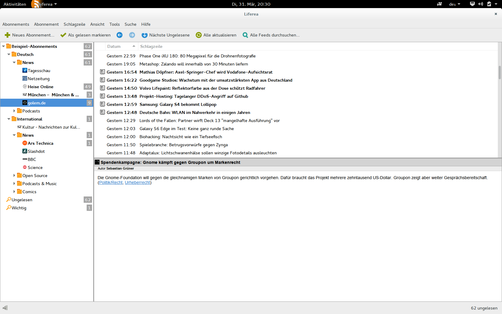

*********************
Vorhandene Feedreader
*********************

Um einen Eindruck von bereits vorhandenen Feedreadern zu erhalten und
anschließende Designentscheidungen bei *gylfeed* besser nachvollziehen zu
können, wird das Grundkonzept dieser Feedreader kurz vorgestellt. 

Konzepte aktueller Feedreader
=============================
Der Großteil der vorhandenen Feedreader, in diesem Fall speziell Feedreader, die
als eigenständige Desktopsoftware funktionieren, sind an den Aufbau eines
Mailclients angelehnt.
Als Veranschaulichung wird der Feedreader *Liferea* herangezogen. *Liferea*
wurde deshalb ausgewählt, weil er die folgenden Eigenschaften besitzt, die auch
für *gylfeed* vorgesehen sind:

 * Entwickelt für Linux-Distributionen.
 * Verwendung von GTK als Oberflächentechnik.
 * Lizenzierung unter GNU GPL.
 * Leichte Bedienbarkeit.

Weitere Desktop-Feedreader, die vergleichbar im Aufbau sind, wären beispielsweise *RSSOwl*
(:cite:`RSSOwl`),
*Vienna* (:cite:`Vienna`) oder *QuiteRSS* (:cite:`QRSS`). Zu *RSSOwl* und *QuiteRSS* sind im Anhang A
(:ref:`feedreader`) Screenshots zu sehen. 

Der Feedreader *Liferea*
========================

*Liferea* steht für *Linux Feed Reader* und wird seit 2003 stetig
weiterentwickelt. Die Benutzeroberfläche hat den Aufbau eines klassischen
Mailclients. Entwickelt wurde *Liferea* hauptsächlich in der Programmiersprache
C. Die Projektseite selbst (vgl. :cite:`PSL`) gibt den Umfang des Codes mit ca.
27.000 Zeilen an.

.. _liferea:

    
    Der Feedreader *Liferea*.

Grundfunktionalitäten
---------------------

Die Grundfunktionalitäten von *Liferea* werden anhand der Benutzeroberfläche (siehe Abbildung :num:`liferea`) erläutert.
In der Werkzeugleiste sind folgende Funktionalitäten zu finden:

 * Feed hinzufügen
 * Feed als gelesen markieren
 * Navigationspfeile
 * Nächsten ungelesenen Eintrag aufrufen
 * Alle aktualisieren
 * Alle Feeds durchsuchen

Links ist eine Baumansicht der Feeds implementiert. Die Feeds können in Ordnern
verwaltet werden. Zu jedem Feed gibt es ein Label, das die Anzahl der
ungelesenen Nachrichten anzeigt.

Die rechte Seite enthält ein Fenster mit aufgelisteten Nachrichten und ein
Fenster, das den Inhalt der jeweils ausgewählten Nachricht anzeigt. Für die
Anordnung dieser beiden Fenster gibt es zusätzlich Einstellmöglichkeiten.
Im Grunde liegt hier tatsächlich der Aufbau eines klassischen Mailclients vor.

Neben den genannten Funktionalitäten kann über einen separaten
Einstellungsdialog beispielsweise das Update-Intervall oder Optionen für Ordner
gesetzt werden. 

Es können die Formate RSS, Atom, CDF(Common Data Format), OCS(Open Collaboration Services) 
und OPML(Outline Processor Markup Language) gelesen werden. *Liferea* bietet außerdem einen 
eingebetteten Browser an. Zusätzlich können Links in externen 
Browsern geöffnet werden.

Positive Eigenschaften
----------------------

Positiv anzumerken ist der Gesamteindruck, den *Liferea* hinterlässt. *Liferea*
bietet neben soliden Grundfunktionalitäten verschiedene Wege der
Individualisierung. Zu nennen wären hier die Einbindung von Plugins oder das
Anpassen der Benutzeroberfläche an die individuellen Bedürfnisse.
Ob die Vielzahl an möglichen Einstellungen eher positiv oder negativ zu bewerten
ist, hängt von den Präferenzen des jeweiligen Benutzers ab.

Negative, verbesserungswürdige Eigenschaften
--------------------------------------------

*Liferea* legt viel Wert auf verschiedenste Einstellungen. Zu wenig
Beachtung wurde dabei auf den eigentlichen Inhalt der Nachrichten gelegt. Dieser
wird relativ lieblos dargestellt. Es entsteht der Eindruck, dass mehr Wert auf
die äußeren Bedingungen, als den Inhalt der Nachrichten selbst, gelegt wird.

Das bereits angesprochene Label für jeden Feed, mit Anzeige der ungelesenen
Nachrichten, ist diskussionswürdig. Bei einem Feedreader werden
grundsätzlich nicht alle Nachrichten gelesen, sondern diejenigen, die für den
Benutzer von Bedeutung sind. Es sollte sich die Frage gestellt werden, ob es
nicht sinnvoller wäre, zusätzlich die Anzahl aktuell neu hinzugekommener
Nachrichten anzuzeigen. Auch denkbar ist ein Hinweis, dass der betreffende Feed
neue Nachrichten hat. Die bloße Anzeige der ungelesenen Nachrichten, ist alleine
in diesem Fall wenig hilfreich.

In den Einstellungen kann die Anzahl der zu speichernden Nachrichten angegeben werden.
Alle Nachrichten, die über diesem Maximalwert liegen, werden
gelöscht. Dieses Konzept ist zu hinterfragen. Liefert ein Feed relativ viele
Nachrichten und dies nicht immer regelmäßig, würden bei einer Einstellung von
100 zu speichernden Nachrichten, möglicherweiße Nachrichten gelöscht, die erst
aktuell veröffentlicht wurden. Es liegt hier also am Benutzer, für jeden Feed
eine Feinjustierung vorzunehmen. Ein anderer Ansatz wäre, Nachrichten anhand
eines Zeitintervalls zu löschen.

Die bereits häufig angesprochene Darstellung der Benutzeroberfläche angelehnt an
klassische Mailclients, ist ebenfalls zu überdenken. Eine häufig genannte
Intension dafür ist, dass Feeds ebenso Nachrichten enthalten, wie es E-Mails
tun. Tatsache ist aber, dass die Nachrichten von Feeds in den meisten Fällen
relativ klein im Umfang sind.

Fazit für die Entwicklung von *gylfeed*
=======================================

*gylfeed* wählt vorallem beim Aufbau der Benutzeroberfläche und der Navigation
einen anderen Ansatz als bereits vorhandene Desktop-Feedreader. Die Aufteilung
der Benutzeroberfläche nach dem Aufbau eines klassischen Mailclients ist bereits in
zahlreichen Feedreadern umgesetzt. Für die Entwicklung für *gylfeed* wird
unter anderem im Vordergrund stehen, eine kompakte Benutzeroberfläche anzubieten, die
sich von den bisherigen Konzepten abhebt.

