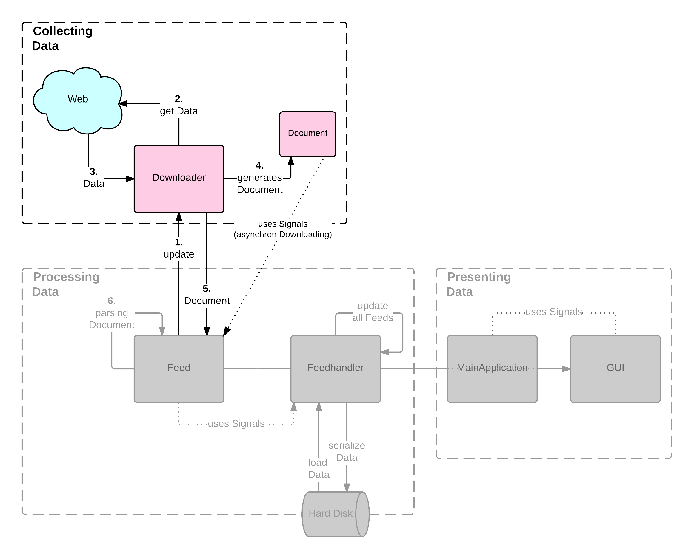

.. _chapterbeschaffung:

**************************
Beschaffung der Feed-Daten 
**************************

Bevor es zur Verarbeitung und der Anzeige der Feed-Daten kommt, müssen diese
Daten beschafft werden. Es werden daraus entstehende Problemstellungen
vorgestellt und Lösungsvorschläge diskutiert. Stichprobentests sollen die
theoretisch erläuterten Lösungen überprüfen. Die Umsetzung der
Feed-Daten-Beschaffung innerhalb von *gylfeed* wird vorgestellt und bewertet.

Ausgangssituation und Problemstellungen
=======================================

In Abbildung :num:`feedprinzip` ist das
Funktionsprinzip eines Newsfeeds dargestellt. Es wird angenommen, dass eine
beliebige Webseite ihre Änderungen über einen Newsfeed mitteilt. 
Die Daten eines Feeds liegen im Regelfall als XML-Datei vor. Aktualisiert die Webseite ihre
Inhalte, werden die Änderungen der XML-Datei hinzugefügt. Zugänglich wird
diese XML-Datei über eine URL gemacht. Die XML-Datei liegt auf einem Webserver und
soll heruntergeladen werden. Der Feedreader fragt in regelmäßigen Abständen beim
Webserver an und holt sich die aktualisierte XML-Datei. An dieser
Stelle wird deutlich, dass sich der Client die Daten beschaffen muss.
Anschließend verarbeitet der Feedreader die XML-Datei und zeigt dem Benutzer die Inhalte an. 

.. _feedprinzip:

.. figure:: ./figs/feedprinzip.png
    :alt: Funktionsprinzip eines Newsfeeds.
    :width: 80%
    :align: center
    
    Funktionsprinzip eines Newsfeeds.

    
Bei der Beschaffung der Feed-Daten ergeben sich Problemstellungen, die im
Folgenden näher betrachtet werden.

.. _performance:

Performance der Anwendung
-------------------------

Der Main-Event-Loop, der in Abschnitt :ref:`maineventloop` vorgestellt wurde,
verarbeitet Aufgaben grundsätzlich synchron. Bei einer synchronen Verarbeitung
wird gewartet, bis eine Aufgabe abgeschlossen ist, erst dann wird mit der
Verarbeitung der nächsten Aufgabe begonnen. Bei einer großen Anzahl an Feeds,
für die ein Download der Daten erfolgen soll, kann während der Beschaffung der
Daten
nichts anderes ausgeführt werden. Die Anwendung ist in diesem Moment
ausschließlich mit dem Download der Feed-Daten beschäftigt. Das bedeutet, dass
sich in dieser Zeit weder die grafische Benutzeroberfläche aktualisieren kann,
noch Benutzereingaben entgegengenommen werden können. Für den Benutzer der Anwendung
ist das wenig erfreulich, er bekommt den Eindruck, dass die Anwendung nicht
ausreichend flüssig läuft.

Bandbreite des Downloads
------------------------

Werden bei jeder Aktualisierung, die vom Client angestoßen wird, alle Feed-Daten
der Feeds
heruntergeladen, obwohl bei Teilen der Feeds keine Änderung vorliegt, 
benötigt dies unnötige Download-Bandbreite. Auf Seiten des
Clients wird eventuell festgestellt, dass keine Aktualisierung vorliegt. Diese Prüfung
beansprucht zusätzlich unnötige Rechenkapazität.

Lösungsansätze
==============

Für die genannten Problemstellungen werden im Folgenden Lösungsansätze
diskutiert.

.. _performancetest:

Synchroner im Vergleich mit asynchronem Ansatz
----------------------------------------------

Eine Alternative zum synchronen Download der Daten ist der asynchrone Ansatz.
In Abbildung :num:`syncasync` ist der zeitliche Ablauf beider Varianten zu sehen. Mit
Hilfe der Abbildung werden beide Varianten vorgestellt und mögliche Vorzüge des
asynchronen Ansatzes erläutert.

.. _syncasync:

.. figure:: ./figs/syncasync.png
    :alt: Schematische Darstellung des synchronen und asynchronen Ansatzes.
    :width: 80%
    :align: center
    
    Schematische Darstellung des synchronen und asynchronen Ansatzes.

Jeder Pfeil beschreibt den Ablauf folgender Aufgaben, die abgearbeitet werden
sollen:

 * Klick auf einen Button, um Download auszulösen.
 * Download von Daten.
 * Grafische Benutzeroberfläche: Daten aktualisieren und Benutzereingaben
   entgegennehmen.
    
Der klassische synchrone Ansatz verarbeitet die drei Aufgaben nacheinander. Die
nächste Aufgabe wird erst ausgeführt, sobald die aktuelle beendet ist. Als
erstes wird der Klick auf den Button verarbeitet, anschließend der Download und
abschließend die Belange der grafischen Benutzeroberfläche. Ein
Nachteil dieser Herangehensweise ist, dass während des
Downloads keinerlei Aktualisierungen oder Eingaben auf der grafischen
Benutzeroberfläche getätigt werden können. Da ein Download, im Vergleich zu
einfachen Operationen, wie beispielsweise den Klick auf einen Button, relativ
viel Zeit in Anspruch nimmt, ist das für die Performance der Anwendung suboptimal.

Aus diesem Grund wird der Download häufig manuell in Teilpakete aufgeteilt.
Diese Herangehensweise stellt der mittlere Pfeil dar. Hier erfolgt ebenso als
erstes der Klick auf den Button. Anschließend wird der Download, in der
entsprechend angegebenen Größe abgearbeitet. Es erfolgt sozusagen ein teilweises
Herunterladen des Gesamtpakets. Darauf folgt die Abarbeitung der
Anliegen der grafischen Benutzeroberfläche. Dieser Wechsel zwischen Download und
grafischer Benutzeroberfläche wird bis zum Abschluss des Downloads durchgeführt.
Auf diese Weise kann der Nachteil des klassischen synchronen Ansatzes umgangen
werden. Die grafische Benutzeroberfläche hat immer wieder Gelegenheit,
Aktualisierungen durchzuführen und Benutzereingaben entgegenzunehmen. Bei dieser
Herangehensweise kommt jedoch ein anderer Nachteil hinzu. In der Abbildung wird
bereits deutlich, dass dieser Ansatz, im Vergleich zum klassischen synchronen
Ansatz, mehr Zeit in Anspruch nimmt. Nach der Abarbeitung von Aufgaben der
grafischen Benutzeroberfläche kommt es zu Wartezeiten. Ein Grund dafür ist beispielsweise, dass
der Download nicht sofort weitergeführt werden kann, weil eventuell erneut eine
Verbindung aufgebaut werden muss.

Genau an dieser Stelle setzt der asynchrone Ansatz an. Der grundsätzliche
Unterschied zum synchronen Ansatz ist, dass der asynchrone Ansatz nicht wartet,
bis eine Aufgabe abgearbeitet ist. Es gibt sozusagen keine blockierenden
Operationen. Diese Unterscheidung kann genutzt werden, um
in den Wartephasen andere Aufgaben abzuarbeiten. Das hat zur Folge, dass der
asynchrone Ansatz nicht mehr Zeit in Anspruch nimmt, als der synchrone Ansatz
und zudem den Vorteil bietet, dass verschiedene Aufgaben im Wechsel ausgeführt
werden können. Wie in der Abbildung zu sehen ist, nutzt der asynchrone Ansatz
mögliche Wartezeiten beim Download, um Belange der grafischen Benutzeroberfläche
abzuarbeiten.

.. _plot:

    
    Vergleich der Downloadgeschwindigkeit von synchroner und asynchroner
    Ausführung. Gemessen für 5, 10, 20, 30, 40 und 50 URLs. Durchschnitt aus
    jeweils 10 Durchfläufen gebildet.

**Performance-Test**:

Um den Vorteil des asynchronen Ansatzes in der Praxis zu testen, wurde für
beide Ansätze ein Performancetest durchgeführt. Für eine steigende Menge an
URLs (5, 10, 20, 30, 40, 50) wurde der Inhalt heruntergeladen. Um statistische
Ausreißer abzumildern, wurde der Durchschnitt aus 10 Durchläufen gebildet.
Die Messungen haben ergeben, dass der asynchrone Ansatz dem synchronen
Ansatz bezüglich der Dauer des Downloads klar überlegen ist. 
In Abbildung :num:`plot` ist das Ergebnis der Messung grafisch dargestellt.
Beide Ansätze verzeichnen einen Anstieg der Downloaddauer bei steigender Anzahl
an URLs. Beim asynchronen Ansatz fällt die Steigerung jedoch deutlich weniger
stark aus. Beide Skripte zur Ausführung des Performance-Tests sind in Anhang A (:ref:`performancesync`)
und Anhang B (:ref:`performanceasync`) zu finden.

**Testumgebung**:

Der Performance-Test für die Download-Geschwindigkeit bei synchronem und
asynchronem Download der Feed-Daten wurde auf folgendem System durchgeführt:

• OS: Fedora 21 (64 bit)
• CPU: Intel Core i7 M620 @ 2,67GHz
• RAM: 8 GB DDR2 RAM

Die verwendete Internetanbindung ist eine DSL 16 Mbit Leitung der Telekom. Laut
Internet-Messverfahren hat diese eine gemittelte Geschwindigkeit von ungefähr 13 Mbit/s
(Download) und 2 Mbit/s (Upload).

.. _etagtest:

Prüfung auf Änderungen der Feed-Daten 
-------------------------------------

Um zu vermeiden, dass Feed-Daten heruntergeladen werden, die keine
Aktualisierungen enthalten, sind die Attribute *ETag* und *last-modified*
hilfreich. In diesem Zusammenhang soll vorerst der Hintergrund dieser Attribute
geklärt werden. 

Das *Hypertext Transfer Protocol* (HTTP) stellt Methoden zur Verfügung, die
für die Kommunikation zwischen Client und Server eingesetzt werden. Der Client
sendet eine Anfrage unter Angabe einer dieser Methoden und der Server sendet
eine Antwort. Mit der Methode *GET* stellt der Client die Anfrage, die hinter
der Quelle befindlichen Daten zu senden. Will man lediglich Informationen
zur Quelle und nicht sofort die dazugehörigen Daten mitgeliefert bekommen, ist
die Methode *HEAD* zu verwenden. In diesem Fall liefert der Server den *Header*
der Quelle. Dieser sogenannte *Header* enthält die Attribute *ETag* und
*last-modified*. Anhand dieser Attribute kann festgestellt werden, ob sich der Inhalt der Quelle
aktualisiert hat.

Beispiel eines HTTP-Headers -- der Atom-Feed von *golem.de*:

.. code-block:: python

    ({'status': '200', 
    'x-upstream': 'www3.golem.de', 
    'keep-alive': 'timeout=3', 
    'date': 'Tue,09 Jun 2015 12:16:34 GMT', 
    'content-disposition': 'inline; filename=feed_full-ATOM1.0.xml',
    'connection': 'keep-alive', 
    'content-type': 'application/atom+xml; charset=utf-8', 
    'last-modified': 'Tue, 09 Jun 2015 12:07:37 GMT', 
    'etag': 'RSS-27c545389b8b11f6598ac6d188fc5683',
    'content-location': 'http://rss.golem.de/rss.php?feed=ATOM1.0', 
    'server': 'nginx', 
    'cache-control': 'private'}, 
    b'')

Der Header beginnt mit dem Status-Code 200. d.h. die Anfrage war erfolgreich.
Neben Attributen, wie *date* und *content-type* enthält dieser Header auch die
bereits erwähnten Attribute *last-modified* und *ETag*.

**last-modified**: Gourley und Totty beschreiben in *HTTP -- The definite Guide*
(vgl. :cite:`gourley`, S.73)
*last-modified* als Attribut, das angibt, zu welchem Zeitpunkt die Entität das letzte Mal geändert wurde.
Im Kontext von Feeds, ist unter Entität die XML-Datei auf dem Webserver zu
verstehen. Bei einer erneuten Anfrage kann das Datum der letzten Änderung dazu
verwendet werden, um beim Server nachzufragen, ob sich dieses Attribut bereits geändert hat
und neue Daten verfügbar sind. Das geschieht mit dem Anfrage-Attribut
*If-Modified-Since* und der Angabe des Datums der letzten Änderung. Liefert der
Server den Status-Code 304 (Not Modified), liegt keine Änderung der Daten vor.

**ETag**: Der *Entity Tag* ist ein eindeutiger Validator einer bestimmten
Instanz einer Entität. So beschreiben Gourley und Totty das Attribut *ETag*
(vgl. :cite:`gourley`, S.367).
Hinter dem *ETag* verbirgt sich ein Hashwert, der vom Server beliebig bestimmt
werden kann. Ändern sich die Daten der Entität, muss ein anderer Hashwert
bestimmt werden. Vergleichbar mit dem Vorgehen beim Attribut *last-modified*
wird bei einer Anfrage an den Server der ETag mit dem Attribut *If-None-Match*
der Anfrage angehängt. Liefert der Server den Status-Code 304 (Not Modified), gilt auch hier,
dass keine Änderung der Daten vorliegt.

Beide Attribute stellen eine valide Möglichkeit dar, festzustellen, ob die Daten
eines Feeds aktualisiert wurden. Sendet der Server auf eine Anfrage den Status-Code 304,
ist für diesen Feed klar, dass keine Änderung vorliegt und deshalb kein Download
erfolgen muss. Nicht jeder Server liefert die Attribute *last-modified* oder *ETag*. Ist keines
der beiden vorhanden, müssen die Feed-Daten trotzdem heruntergeladen werden.

**Stichproben-Test**:

Um eine Aussage treffen zu können, wie groß der Anteil der Feeds ist, die
mindestens eines
der beiden Attribute liefern, wurde eine Testmenge an Feeds einer Prüfung auf
diese Attribute unterzogen. Die Testmenge umfasst nach Entfernen der Feeds, die
keinen validen Statuscode geliefert haben, 3.512 Feeds. Grundlage dafür
sind 10 Feedlisten (insgesamt 6.203 URLs) des Online-Anbieters für Feedlisten, *feedshare.net* (vgl.
:cite:`feedshare`).
Es wurde eine relativ große Testmenge gewählt, um ein aussagekräftiges Ergebnis
zu erhalten. Für die 3.512 Feeds wurde jeweils der HTTP-Header angefordert und
eine Prüfung auf die Attribute *last-modified* und *ETag* durchgeführt. Das
dafür verwendete Skript ist in Anhang C (:ref:`etaglastmodi`) zu finden.

Tabelle :num:`attribute-statistics` zeigt das Ergebnis des Tests.
Die Ergebnisse beziehen sich auf 3.512 Feeds, deren Server eine valide Antwort
(Status Code 200) geliefert hat. Es ist zu erkennen, dass der Anteil an Feeds, 
die das Attribut *last-modified* liefern (80,10%) deutlich größer ist, als der Anteil, 
der das Attribut *ETag* liefert (24,87%). Beide Attribute wurden von 741 (21,10%) geliefert.
Von 566 Feeds (16,12%) wurde keines der Attribute geliefert. Der bedeutenste
Wert ist der Anteil der Feeds, die mindestens eines der beiden Attribute
liefert (83,88% siehe Abbildung :num:`piechart`). Da es bei der Prüfung auf Änderung der Feed-Daten ausreichend
ist, durch eines der Attribute validieren zu können, ob eine Änderung
stattgefunden hat, ist dieser Wert entscheidend.
 
.. figtable::
    :label: attribute-statistics
    :caption: Testergebnisse der Prüfung auf die Attribute ETag und
              last-modified bei 3.512 Feeds mit Status-Code 200. Für 83,88 % der
              3.512 Feeds wird eines der beiden Attribute geliefert.
    :alt: Testergebnisse der Prüfung auf die Attribute ETag und last-modified.
    :spec: l l l

    ============================================ ============  ==========
      **Attribut/Vorkommen**                      **absolut**   **in %** 
    ============================================ ============  ==========
     **last-modified**                            2.813         80,10    
     **ETag**                                     874           24,87    
     **last-modified und ETag**                   741           21,10    
     **mind. ein Attribut**                       2.946         83,88    
     **ohne Attribut**                            566           16,12    
     |hline| **valide Feeds** (status code 200)   3.512         100,00
    ============================================ ============  ==========

   
Zusammenfassend hat der Test ergeben, dass ein Großteil der Webserver, auf denen die Feed-Daten lagern,
mindestens eines der Attribute *last-modified* oder *ETag* liefern. Das spricht für das bereits beschriebene 
Vorgehen, beim Download der Feed-Daten vorerst die Prüfung auf eine Änderung durchzuführen. Lediglich für 16,12 %
der 3.512 Feeds müssten die kompletten Feed-Daten heruntergeladen werden, um zu
prüfen, ob eine Änderung der Daten vorliegt.

.. _piechart:

          last-modified.
    :width: 80%
    :align: center
    
    Der Anteil der Feeds, die mindestens eines der Attribute *last-modified* oder
    *ETag* liefern beträgt 83,88% von 3.512 getesteten Feeds. 

Umsetzung innerhalb von *gylfeed*
=================================

Die Herausforderungen, die sich bei der Beschaffung der Feed-Daten ergeben, wurden
erläutert und mögliche Lösungsansätze vorgestellt. Nun wird betrachtet, wie die
Beschaffung der Feed-Daten in *gylfeed* umgesetzt wurde.

Asynchroner Download mit *libsoup*
----------------------------------

In *gylfeed* wird der Download der Feed-Daten mit der HTTP-Bibliothek *libsoup*
(vgl. :cite:`libsoup`)
umgesetzt. Zu Beginn der Entwicklung wurde der Download mit dem
*Universal Feedparser* (vgl. :cite:`FPD`) durchgeführt. Dieser ist für die spätere Verarbeitung der Daten zuständig,
bietet jedoch nur einen synchronen Download an. Da es mit dem *Universal Feedparser* zu den in Abschnitt :ref:`performance`
erläuterten Performance-Problemen kam, wurde der Download daraufhin asynchron umgesetzt.
Die Bibliothek *libsoup* wurde aufgrund folgender Eigenschaften gewählt:

 * Bietet asynchrone API.
 * Zugeschnitten auf GNOME Anwendungen, wie *gylfeed*.
 * Nutzt GObject und GLib-Main-Loop, wie auch bereits *gylfeed*.

Ablauf des Downloads
--------------------

In Abbildung :num:`download` ist der Teil von *gylfeed* dargestellt, der für die
Beschaffung der Daten zuständig ist. Bevor auf den Ablauf näher eingegangen
wird, werden die beteiligten Instanzen vorgestellt.

.. _download:

    
    Grundkonzept der Datenbeschaffung innerhalb von *gylfeed*, farbig
    dargestellt. 

**Feed:** Die Klasse *Feed* beauftragt den Download und erwartet eine Instanz
der Klasse *Document*. Dieses *Document* enthält die Feed-Daten, die
innerhalb der Instanz *Feed* verarbeitet werden.

**Downloader:** Der *Downloader* verwaltet den kompletten asynchronen Downloadvorgang.

**Document:** Eine Instanz der Klasse *Document* wird als sogenanntes
*Future-Objekt* eingesetzt. Dieses *Future-Objekt* wird von der Klasse
*Downloader* als Platzhalter für das zu erwartende Ergebnis des asynchronen Downloads
eingesetzt.

**Web:** Das *Web* respräsentiert im vorliegenden Fall sämtliche Webserver, die
eine Anfrage erhalten und daraufhin eine Antwort senden.

.. _downloadsequenz:

    
    Ablauf des Downloadvorgangs.

Eine detaillierte Beschreibung des Downloadvorgangs soll anhand der Abbildung
:num:`downloadsequenz` erfolgen. Das Objekt *Feed* startet den Vorgang mit dem Aufruf der Methode
*download()* des Objekts *Downloader*. Hierzu übergibt der *Feed* als Parameter
die URL des Feeds, für den der Download erfolgen soll. Innerhalb der Methode *download()* wird
entschieden, ob ein Download der kompletten Feed-Daten notwendig ist. Hierzu
werden die bereits erwähnten Attribute *last-modified* und *ETag* verwendet.
Liefert der Webserver, auf dem die entsprechenden Feed-Daten lagern den
Status-Code 304, gibt die Methode *download()* ein *None* zurück und der Vorgang ist
abgeschlossen. Ergibt die Prüfung auf Aktualisierung der Feed-Daten jedoch, dass
ein Download der Feed-Daten erfolgen muss, wird die Methode *get_data()*
aufgerufen. 

**get_data():** Innerhalb dieser Methode wird eine Nachricht des Typs *Soup.Message*
der Bibliothek *libsoup* erstellt. Hier wird die HTTP-Methode *GET* und die URL
übergeben. Anschließend wird eine Instanz der Klasse *Document* erstellt, die, 
wie bereits erwähnt, als Platzhalter für das zu erwartende Ergebnis des
asynchronen Downloads eingesetzt wird. Bevor die Instanz des *Documents* an den
Aufrufer, d.h. den *Feed* zurückgegeben wird, erfolgt der asynchrone Aufruf der
Methode *send_async()* der Bibliothek *libsoup*. Hierdurch wird die Verbindung
zum Webserver aufgebaut. Steht die Verbindung, wird die der Methode
*send_async()* übergebene Callback-Methode *read_stream()* aufgerufen.

Das Feedobjekt, das eine Instanz von *Document* erhalten hat, registriert sich
auf dessen Signal *finish*. Auf diese Weise wird das Feedobjekt informiert,
sobald der asynchrone Download abgeschlossen ist und mit der Verarbeitung der
Daten begonnen werden kann.

**read_stream():** Innerhalb dieser Methode wird das Lesen des
Inputstreams durch *read_bytes_async()* veranlasst. Als Callback-Methode wird *fill_document()*
übergeben.

**fill_document():** Diese Methode liest den Input-Stream solange, bis keine
Daten mehr vorhanden sind. Bei jeder Iteration werden die Daten, die von der
Instanz *Document* gesammelt werden, um die neuen Daten erweitert. Sind alle
Daten gelesen, wird das Signal *finish* ausgelöst.

Prüfung auf Aktualisierung mittels *ETag* und *last-modified*
-------------------------------------------------------------

Die im Ablauf des Downloads erwähnte Prüfung auf Aktualisierung der Feed-Daten
wird an dieser Stelle separat betrachtet. Es wird kurz auf die Anwendung
eingegangen und die entsprechende Antwort des Webservers gezeigt.

Zur Demonstration wird eine Anfrage an den Servers des Atom-Feeds von *golem.de*
gestellt. Folgendes Code-Snippet zeigt die Prüfung auf das Attribut
*last-modified*:

.. code-block:: python
    
    URL = "http://rss.golem.de/rss.php?feed=ATOM1.0"
    DATE = "Mon, 15 Jun 2015 19:37:27 GMT"
    session = Soup.Session() 

    message = Soup.Message.new("GET", URL)
    message.request_headers.append("if-modified-since", DATE)
    session.send_message(message)
    new_date = message.response_headers.get("last-modified")
    print("Status Code:", message.status_code, "; Date:", new_date)
    >>> Status Code: 200; Date: Wed, 17 Jun 2015 15:11:36 GMT
    
    message = Soup.Message.new("GET", URL)
    message.request_headers.append("if-modified-since", new_date)
    session.send_message(message)
    date = message.response_headers.get("last-modified")
    print("Status-Code:", message.status_code, "; Date:", date)
    >>> Status-Code: 304; Date: Wed, 17 Jun 2015 15:11:36 GMT

Es wird mit Hilfe der Bibliothek *libsoup* eine Session erstellt. Anschließend
wird eine sogenannte *Message* erstellt. Diese enthält die anzuwendende
HTTP-Methode und die anzufragende URL. In diesem Fall wird *GET* als
HTTP-Methode verwendet, weil bei der Übergabe des *if-modified-since* Attributs
der Inhalt der Antwort nur gesendet wird, wenn tatsächlich eine Änderung seitens
des Servers vorliegt. Im nächsten Schritt wird der *Message* ein Anfrage-Header
angehängt, der das Attribut *if-modified-since* und den dazugehörigen Wert, ein
*last-modified*, enthält. Zuletzt wird die Nachricht versendet. Im ersten
Durchlauf antwortet der Server mit dem Status-Code 200 und sendet den *body*,
d.h. den Inhalt der Antwort mit.

Der einzige Unterschied der nächsten Anfrage ist,
dass als *last-modified*-Wert der beim ersten Durchlauf vom Server gelieferte
*last-modified*-Wert eingesetzt wird. Jetzt antwortet der Server mit dem Status-Code 304, d.h.
es liegt keine Änderung vor. In diesem Fall wird kein Inhalt gesendet.

Für das Attribut *ETag* erfolgt der Vorgang in der gleichen Weise, mit dem
Unterschied, dass der Anfrage-Header aus dem Attribut *if-none-match* und dem
*ETag* als Wert besteht. 

Bewertung der Umsetzung
----------------------- 

In der aktuellen Version von *gylfeed* wird die Prüfung auf Änderung der
Feed-Daten auf der Client-Seite ausgeführt. Dies ist noch suboptimal. 
Für die entsprechende URL wird der
Header heruntergeladen und es wird eine Prüfung auf Übereinstimmung des bisher
gespeicherten *last-modified* bzw. *ETag*-Wertes durchgeführt. Die Umstellung auf die
komfortablere Variante, die Prüfung auf Seiten des Servers durchführen zu lassen, ist geplant.

Der Einsatz des asynchronen Downloads in der vorgestellten Form ist zum
aktuellen Zeitpunkt eine gute Lösung.

