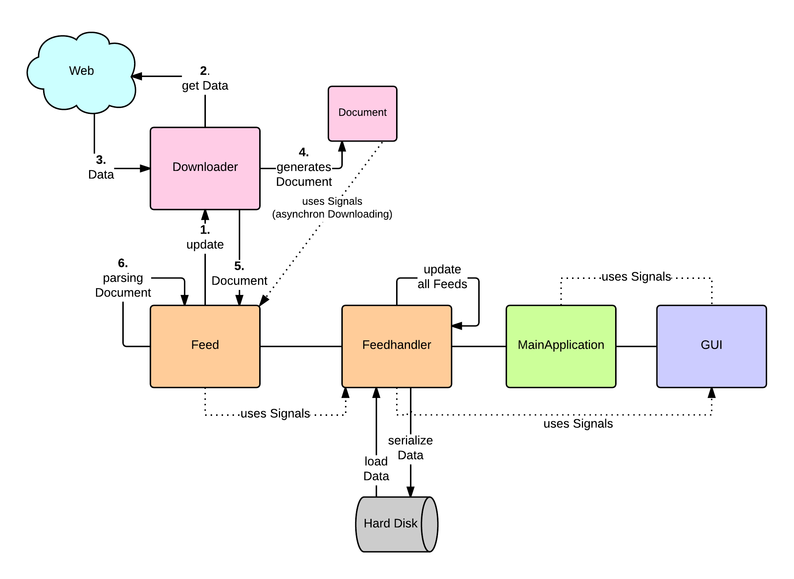

******************
Architekturentwurf
******************

In diesem Kapitel wird die Architektur der Software *gylfeed* vorgestellt.
Hierzu werden die Anforderungen aus Kapitel XX herangezogen. Eine
detaillierte Beschreibungen der einzelnen Klassen, tiefergehende Erläuterungen
zur Algorithmik und aufgetretene Schwierigkeiten sind Bestandteil der
Bachelorarbeit.

Herausforderungen und Lösungsansätze
====================================

Nun gilt es, für die gestellten Anforderungen Lösungsansätze zu entwickeln.
Hierzu sollen vorerst grundlegende Bestandteile der Software geklärt werden.

**Beschaffung der Daten:** Die Daten der Feeds müssen beschafft, also
heruntergeladen und verarbeitet, also geparst werden. Hier liefern die
Bibliotheken von Python mögliche Ansätze.

**Verwaltung der Daten:** Die Daten, die eindeutig einem Feed zugeordnet werden
können, werden innerhalb eines Feedobjekts gekapselt. Dem übergeordnet ist eine
Instanz, die jene Feedobjekte aufnimmt: der Feedhandler. Dieser ist auch dafür
zuständig, die konsistent zu speichernden Daten zu speichern und zu laden.

**Updates:** Die Spezifiktion stellt die Anforderung, dass Updates andere
Prozesse nicht beeinträchtigen dürfen. Hier ist das asynchrone Aktualisieren der
Feeds ein Lösungsansatz.

**Benutzeroberfläche:** Für die Benutzerobefläche ist ein neues Konzept
gefordert. Hierzu werden Entwürfe erstellt.

.. _klassendiagramm:

.. figure:: ./figs/klassendiagramm.png
    :alt: Übersicht der Klassen von *gylfeed*
    :width: 100%
    :align: center
    
    Übersicht der Klassen von *gylfeed*.

Übersicht der Klassen
=====================

Abbildung :num:`klassendiagramm` zeigt die Klassen, die von *gylfeed* verwendet
werden. Jede Klasse soll kurz vorgestellt werden.

**MainApplication:** Die Klasse *MainApplication* wird durch *gylfeed.py*
initialisiert. Hier erfolgt der Start des Programms.

**Feedhandler:** In der *MainApplication* wird eine Instanz der Klasse
*Feedhandler* erstellt. Der Feedhandler hält die Instanzen aller erstellten
Feeds. Außerdem benutzt der Feedhandler die Klasse *Downloader* zum
herunterladen der Feed-Daten.

**Feed:** Die Klasse *Feed* repräsentiert ein Abonnement eines Feeds. Von dieser
Klasse wird die Klasse *SumFeed* abgeleitet. *Feed* benutzt selbst auch die
Klasse *Downloader*. Anders als bei der Klasse *Feedhandler* wird hier die
Aktualisierung in Intervallen durchgeführt, die für jeden Feed individuell sind.

**SumFeed:** SumFeed leitet von *Feed* ab und stellt die Gesamtheit der Feeds
dar. Kann aufgrund der Ableitung von *Feed* aber wie ein *Feed* agieren.

**Downloader:** Die Klasse *Download* beschafft die von den Klassen *Feed* und
*Feedhandler* angefragten Daten. Hierzu verwendet sie die Klasse *Document*.

**Document:** 

**MainWindow:** Eine Instanz der Klasse *MainWindow* wird durch die Klasse *MainApplication*
erstellt. *MainWindow* beinhaltet die Unteransichten *FeedView*,
*EntryListView*, *EntryDetailsView* und *FeedOptionsView*. *MainWindow* arbeitet
mit einem Stack, für dessen Verwaltung die Klasse *ViewSwitcher* benutzt wird.

**ViewSwitcher:** Die Klasse *MainWindow* instanziiert einen *ViewSwitcher*.
Dieser ist für die Verwaltung der einzelnen Views zuständig.

**View:** View ist die Oberklasse von *FeedView*, *EntryListView*,
*EntryDetailsView* und *FeedOptionsView*.

**FeedView:** *Feedview* leitet von der Oberklasse *View* ab und beihnaltet
selbst n *FeedRows*. Diese spezialisierte View wird die vorhandenen Feeds
anzeigen.

**FeedRow:** Eine Instanz der Klasse *FeedRow* ist Bestandteil der Klasse
*FeedView*. *FeedView* selbst hat eine Listenansicht. Eine Zeile dieser Liste
entspricht einer *FeedRow*.

**IndicatorLabel:**

**EntryListView:** *EntryListView* leitet von der Oberklasse *View* ab und
beinhaltet selbst n *EntryRows*. Diese spezialisierte View wird die vorhandenen
Entries anzeigen.

**EntryRow:** Eine Instanz der Klasse *EntryRow* ist Bestandteil der Klasse
*EntryListView*. *EntryListView selbst hat eine Listenansicht. Eine Zeile dieser
Liste entspricht einer *EntryRow*.

**EntryDetailsView:** *EntryDetailsView* leitet von der Oberklasse *View* ab und
zeigt die Details eines einzelnen Entry an.

**FeedOptionsView:** *FeedOptionsView* leitet von der Oberklasse *View* ab und
beinhaltet sämtliche Optionen, die für einen Feed gesetzt werden können.

Erläuterung des Grundkonzepts von *gylfeed*
===========================================

Da die einzelnen Klassen nun bekannt sind, wird das in Abbildung 
:num:`funktionsprinzip` dargestellte Grundkonzept von *gylfeed* erläutert.
Die Darstellung zeigt die grundsätzliche Funktionsweise von *gylfeed*. Die
Akteure sind bereits aus dem Klassendiagramm bekannt.

Die Nummerierungen der Aktionen dienen zur Orientierung und werden an dieser
Stelle verwendet, um mit der Beschreibung des Diagramms zu beginnen.

Es wird angenommen, im Objekt Feed wird gefordert ein Update durchzuführen (1).
Dieser Auftrag wird an den Downloader weitergegeben. Dieser lädt die angefragten
Daten über das Web herunter (2). An dieser Stelle ist anzumerken, dass hier nicht
grundsätzlich die kompletten Daten des Feeds heruntergeladen werden. Lässt es
die Struktur des betreffenden Feeds zu, wird nur dann ein kompletter Download
der Daten des Feeds durchgeführt, wenn sich dieser tatsächlich geändert hat.
Hier gibt es verschiedene Möglichkeiten festzustellen, ob eine Änderung vorliegt,
worauf zu einem späteren Zeitpunkt eingegangen wird.

.. _funktionsprinzip:

    
    Das Grundkonzept von *gylfeed*.

Im nächsten Schritt empfängt der Downloader die Daten aus dem Web (3). Die Instanz
Document wird dazu verwendet, einen asynchronen Download der Daten zu
ermöglichen ????????? (4). Die Instanz des Documents wird an den Feed zur weiteren
Verarbeitung gegeben (5). Das Weiterverarbeiten im Feed wird dadurch ausgelöst,
indem sich der Feed auf ein Signal von der Instanz Document registriert. Sobald
das Document komplett heruntergeladen ist, wird das entsprechende Signal
ausgelöst und die im Document enthaltenen Daten werden im Feed geparst (6).

Der Feed kommuniziert an den Feedhandler, dass er sich aktualisiert hat. Der
Feedhandler reicht das Signal an die Benutzeroberfläche weiter. Die Änderungen
werden graphisch dargestellt.

Im Feedhandler werden Updates ausgelöst, die manuell vom Benutzer angefordert
werden. Da dies für alle Feeds geschieht, ist es die Aufgabe des Feedhandlers, der
als Verwalter der Feeds funktioniert. Er lässt für jeden Feed eine
Aktualisierung durchführen. Die Aktualisierung im Feed selbst entspricht dem
Ablauf von den genannten (1) bis (6) Schritten. Eine weitere Aufgabe des
Feedhandlers ist die persistente Speicherung der Daten, sowie das Laden dieser
Daten beim Start der Software.

Die Benutzeroberfläche kommuniziert Eingaben des Benutzers unter der Verwendung von
Signalen an die jeweilige logische Einheit. An dieser Stelle wird zum besseren
Verständnis das Konzept von Signalen innerhalb Gtk kurz erläutert. Eine genaue
Betrachtung und Einzelheiten zu Signalen sind Bestandteil der Bachelorarbeit.

Als erstes sei erwähnt, dass GTK eventbasiert ist. GTK wartet solange, bis ein
Event ausgelöst wird, beispielsweise durch einen Klick auf einen Button. GTK gibt dieses Event an das
betreffende Widget weiter, hier der Button. Der Button löst in diesem Fall das
Signal *clicked* aus. Dass dieses Auslösen des Signals etwas bewirken kann, musste der Button 
bereits vorher mit diesem Signal verknüpft und eine entsprechende Callback-Funktion
zugewiesen werden. Die Callback-Funktion enthält den gewünschten Code, der ausgeführt
werden soll, wenn genau dieser Button angeklickt wird. Folgendes kurze
Codebeispiel soll das erläuterte Prinzip nochmals anschaulich darstellen.

.. code-block:: python

    from gi.repository import Gtk

    #Callback-Funktion  
    def print_hello(button):
        print("Hello")

    button = Gtk.Button("Print Hello")          # Erstellen eines Buttons
    button.connect('clicked', print_hello)      # Verknüpfen mit Signal 'clicked'
                                                # und Angabe der Callback-Funktion

    window = Gtk.Window()                       # Erstellen eines Fensters
    window.add(button)                          # Hinzufügen von Button zu Fenster
    window.show_all()                           # Alle Bestandteile von window anzeigen

    Gtk.main()                                  # Gtk Main-Loop

Beschreibung der Schnittstellen
===============================

Das Grundkonzept von *gylfeed* ist vorgestellt und die Klassen sind bekannt. Nun
werden die öffentlich angebotenen Schnittstellen der Klassen vorgestellt.

**EntryListView:**

**def clear_listbox():** Leert die Ansicht, um neu dargestellt werden zu können.

**def update_entryview():** Callback-Funktion

**def show_entries():** Lässt die Entries eines Feeds darstellen.

