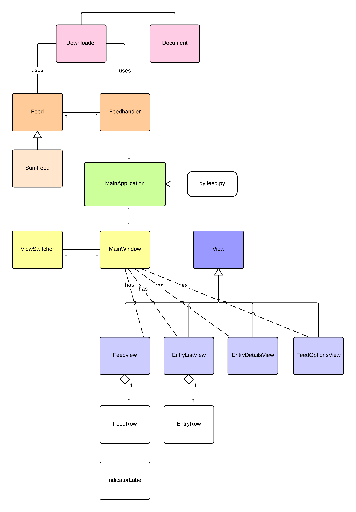
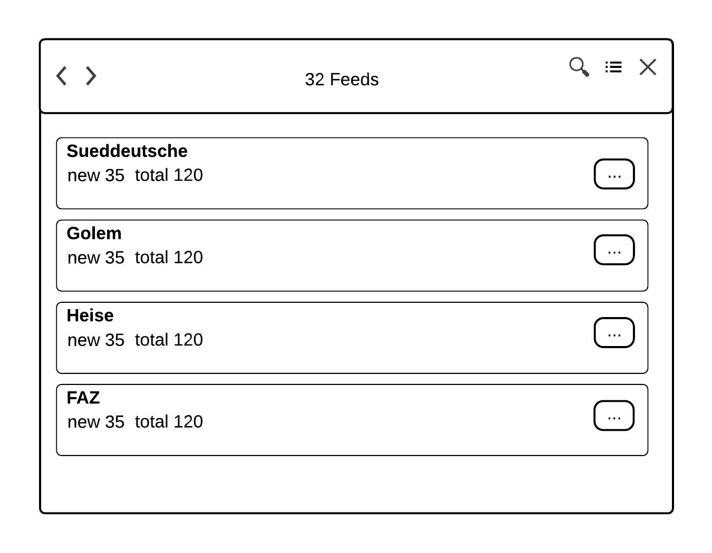

******************
Architekturentwurf
******************

In diesem Kapitel wird die Architektur der Software *gylfeed* vorgestellt.
Hierzu werden die Anforderungen aus Kapitel XX herangezogen. Eine
detaillierte Beschreibungen der einzelnen Klassen, tiefergehende Erläuterungen
zur Algorithmik und aufgetretene Schwierigkeiten sind Bestandteil der
Bachelorarbeit.

Herausforderungen und Lösungsansätze
====================================

Nun gilt es, für die gestellten Anforderungen Lösungsansätze zu entwickeln.
Hierzu sollen vorerst grundlegende Bestandteile der Software geklärt werden.

**Beschaffung der Daten:** Die Daten der Feeds müssen beschafft, also
heruntergeladen und verarbeitet, also geparst werden. Hier liefern die
Bibliotheken von Python mögliche Ansätze.

**Verwaltung der Daten:** Die Daten, die eindeutig einem Feed zugeordnet werden
können, werden innerhalb eines Feedobjekts gekapselt. Dem übergeordnet ist eine
Instanz, die jene Feedobjekte aufnimmt: der Feedhandler. Dieser ist auch dafür
zuständig, die konsistent zu speichernden Daten zu speichern und zu laden.

**Updates:** Die Spezifiktion stellt die Anforderung, dass Updates andere
Prozesse nicht beeinträchtigen dürfen. Hier ist das asynchrone Aktualisieren der
Feeds ein Lösungsansatz.

**Benutzeroberfläche:** Für die Benutzerobefläche ist ein neues Konzept
gefordert. Hierzu werden Entwürfe erstellt.

Im Folgenden ist das Grundkonzept von *gylfeed* dargestellt.

.. _klassendiagramm:

    
    Übersicht der Klassen von *gylfeed*.

Abbildung :num:`klassendiagramm` zeigt die Klassen, die von *gylfeed* verwendet
werden. Jede Klasse soll kurz vorgestellt werden.

**MainApplication:** Die Klasse *MainApplication* wird durch *gylfeed.py*
initialisiert. Hier erfolgt der Start des Programms.

**Feedhandler:** In der *MainApplication* wird eine Instanz der Klasse
*Feedhandler* erstellt. Der Feedhandler hält die Instanzen aller erstellten
Feeds. Außerdem benutzt der Feedhandler die Klasse *Downloader* zum
herunterladen der Feed-Daten.

**Feed:** Die Klasse *Feed* repräsentiert ein Abonnement eines Feeds. Von dieser
Klasse wird die Klasse *SumFeed* abgeleitet. *Feed* benutzt selbst auch die
Klasse *Downloader*. Anders als bei der Klasse *Feedhandler* wird hier die
Aktualisierung in Intervallen durchgeführt, die für jeden Feed individuell sind.

**SumFeed:** SumFeed leitet von *Feed* ab und stellt die Gesamtheit der Feeds
dar. Kann aufgrund der Ableitung von *Feed* aber wie ein *Feed* agieren.

**Downloader:** Die Klasse *Download* beschafft die von den Klassen *Feed* und
*Feedhandler* angefragten Daten. Hierzu verwendet sie die Klasse *Document*.

**Document:** 

**MainWindow:** Eine Instanz der Klasse *MainWindow* wird durch die Klasse *MainApplication*
erstellt. *MainWindow* beinhaltet die Unteransichten *FeedView*,
*EntryListView*, *EntryDetailsView* und *FeedOptionsView*. *MainWindow* arbeitet
mit einem Stack, für dessen Verwaltung die Klasse *ViewSwitcher* benutzt wird.

**ViewSwitcher:** Die Klasse *MainWindow* instanziiert einen *ViewSwitcher*.
Dieser ist für die Verwaltung der einzelnen Views zuständig.

**View:** View ist die Oberklasse von *FeedView*, *EntryListView*,
*EntryDetailsView* und *FeedOptionsView*.

**FeedView:** *Feedview* leitet von der Oberklasse *View* ab und beihnaltet
selbst n *FeedRows*. Diese spezialisierte View wird die vorhandenen Feeds
anzeigen.

**FeedRow:** Eine Instanz der Klasse *FeedRow* ist Bestandteil der Klasse
*FeedView*. *FeedView* selbst hat eine Listenansicht. Eine Zeile dieser Liste
entspricht einer *FeedRow*.

**IndicatorLabel:**

**EntryListView:** *EntryListView* leitet von der Oberklasse *View* ab und
beinhaltet selbst n *EntryRows*. Diese spezialisierte View wird die vorhandenen
Entries anzeigen.

**EntryRow:** Eine Instanz der Klasse *EntryRow* ist Bestandteil der Klasse
*EntryListView*. *EntryListView selbst hat eine Listenansicht. Eine Zeile dieser
Liste entspricht einer *EntryRow*.

**EntryDetailsView:** *EntryDetailsView* leitet von der Oberklasse *View* ab und
zeigt die Details eines einzelnen Entry an.

**FeedOptionsView:** *FeedOptionsView* leitet von der Oberklasse *View* ab und
beinhaltet sämtliche Optionen, die für einen Feed gesetzt werden können.

Entwurf der Benutzerobefläche
=============================

Das Konzept der Benutzeroberfläche wird sich von bisherigen Feedreader abheben.
Im Folgenden wurden Mockups erstellt, um einen ersten Eindruck von der geplanten
Oberfläche zu erhalten.

Abbildung :num:`scratchFeedView` zeigt den Entwurf der Ansicht *FeedView*

.. _scratchFeedView:

    
    Mockup der Ansicht *Feedview*.

