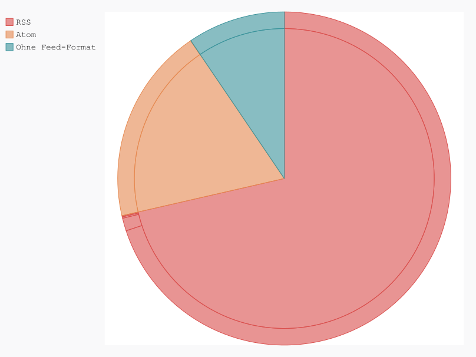
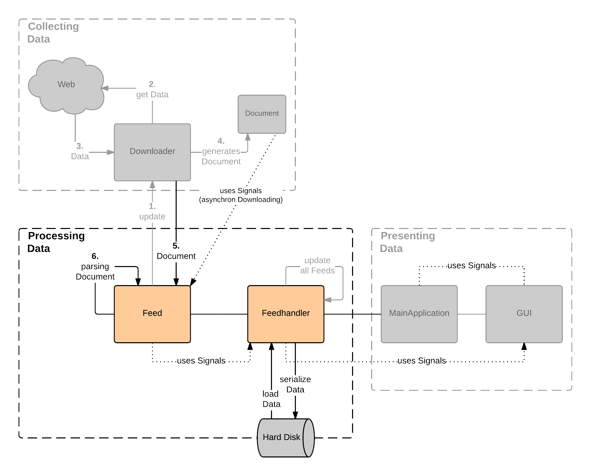
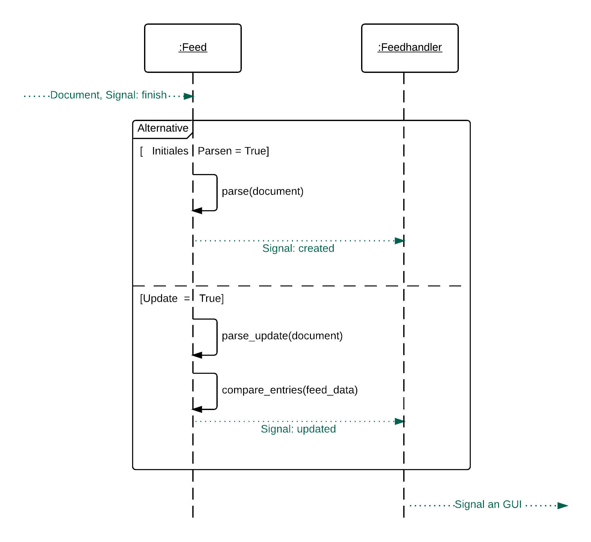

.. _verarbeitung:

***************************
Verarbeitung der Feed-Daten
***************************

Nach der Beschaffung der Feed-Daten stellt sich die Frage, wie diese Daten
verarbeitet werden können. Innerhalb der Projektarbeit *Entwicklung und
Implementierung eines Feedreaders* (vgl. :cite:`kiessling`) wurde Grundlegendes zu Feeds, deren Format
und Aufbau erläutert. An dieser Stelle soll nun eine Analyse der zu
verarbeitenden Feed-Daten durchgeführt werden. Die Verarbeitung der Feed-
Daten innerhalb von *gylfeed*, sowie der dazu eingesetzte Universal Feedparser
werden vorgestellt. 

Analyse der Feed-Daten
======================

Die heruntergeladenen Feed-Daten liegen im Falle von RSS und Atom Feeds als XML-Datei vor. Nun gilt es,
die Daten aus der XML-Datei zu verarbeiten. Um mehr über die Beschaffenheit
der vorliegenden Daten aussagen zu können, werden die Daten verschiedener
Feeds hinsichtlich deren Format und gelieferten XML-Elemente untersucht. 
Diese beiden Faktoren können bei der Verarbeitung der Feed-Daten zu Problemen
führen. Auf diese Probleme wird an späterer Stelle eingegangen. 

Als Analysewerkzeug wurde der Universal Feedparser verwendet. In Abschnitt
:ref:`feedparser` wird dieser Feedparser näher vorgestellt. Für beide Tests 
wurde die bereits in Kapitel :ref:`chapterbeschaffung` -- *Beschaffung der
Feed-Daten* verwendete Testmenge von 6.203 Feeds genutzt.

.. _testfeedformate:

Feedformate
-----------

Wie bereits in der Projektarbeit *Entwicklung und Implementierung eines
Feedreaders* (vgl. :cite:`kiessling`) erwähnt, gibt es eine Vielzahl an Feedformaten und diese in
verschiedenen Versionen. Allein das Format RSS (Really Simple Syndication) 
wurde in sechs verschiedenen Versionen veröffentlicht (vgl. :cite:`HU` -- Historie der RSS-Versionen).

Es soll nun anhand einer
Stichprobe untersucht werden, wie häufig die verschiedenen Feedformate in der
Praxis eingesetzt werden. Ziel ist es, einen Eindruck zu gewinnen, welche
Feedformate tendenziell häufiger als andere verwendet werden.

Das Ergebnis in Tabelle :num:`format-statistics` zeigt, dass von den 5.092 Dateien,
die von der gesamten Testmenge (6.203) heruntergeladen werden konnten, das Format
RSS in der Version 2.0 am häufigsten vorkommt. Atom in der Version 1.0 ist mit
einem Vorkommen von 971 das zweithäufigste Format. Alle anderen erkannten
Formate machen zusammen mit einem Wert von 79 einen geringen Anteil aus.
Dateien, die entweder kein Feed oder fehlerhaft waren, betragen 483. Das Skript
zur Ausführung des Tests ist in Anhang D (:ref:`feedtest`) zu finden. In Abbildung
:num:`plotfeedformate` ist die Summe an Feeds mit einem RSS oder Atom-Format,
bzw. Feeds ohne Format bezogen auf die gesamt getesteten Feeds zu sehen.

.. figtable::
    :label: format-statistics
    :caption: Testergebnisse der Prüfung auf Feedformat für 5.092
              heruntergeladene Dateien.
    :alt: Testergebnisse der Prüfung auf Feedformat.
    :spec: l l r

    ============================================ ============  ==========
      **Feedformat/Vorkommen**                    **absolut**   **in %** 
    ============================================ ============  ==========
     **RSS 2.0**                                    3.559         69,89    
     **RSS 1.0**                                       63           1,24    
     **RSS 0.91**                                       7           0,14    
     **RSS 0.92**                                       5         0,10    
     **RSS 0.90**                                       1         0,02    
     **Atom 1.0**                                     971           19,07    
     **Atom 0.3**                                       3           0,06    
     **ohne Format/fehlerhafte**                      483           9,48    
     |hline| **gesamte Dateien**                   5.092         100,00
    ============================================ ============  ==========

.. _plotfeedformate:

    
    Die Häufigkeit verschiedener Feedformate, untersucht anhand einer
    Stichprobe von 6.203 Feeds.  

.. raw:: Latex

   \newpage
 
    
.. _testxmlelemente:

XML-Elemente
------------

Nicht alle in den jeweiligen Spezifikationen der Feed-Formate definierten Elemente
sind zwingend erforderlich. Das ist verständlich, weil nicht jeder Anbieter
eines Feeds alle möglichen Elemente nutzen möchte. Für die Verarbeitung der Daten
durch den Feedreader ist jedoch kritisch zu betrachten, dass die Anzahl der
Pflicht-Elemente gering ist. Es muss damit gerechnet werden, dass erwartete
Elemente fehlen können. 

Als Beispiel soll das Format RSS 2.0 betrachtet werden.
Für das in der Stichprobe am häufigsten vorkommende Format RSS 2.0 sind lediglich die
Elemente *title*, *link* und *description* bezogen auf den Feed selbst (channel) zwingend
erforderlich. Die Elemente der einzelnen Einträge (items) sind alle optional.
In der Spezifikation wird darauf hingewiesen, dass für einen Eintrag 
mindestens eines der Elemente *title* oder *description* vorhanden sein
muss (vgl. :cite:`rssrequests` -- Spezifikation von RSS 2.0).

.. code-block:: xml

    <?xml version="1.0" encoding="utf-8"?>
    <rss version="2.0">
        <channel>
            <title>Titel des Feeds</title>
            <link>URL der Webpräsenz</link>
            <description>Kurze Beschreibung des Feeds</description>
            <language>Sprache des Feeds</language>
            <copyright>Autor des Feeds</copyright>
            <pubDate>Erstellungsdatum</pubDate>
            <image>
                <url>URL einer einzubindenden Grafik</url>
                <title>Bildtitel</title>
                <link>URL, mit der das Bild verknüpft ist</link>
            </image>
            <item>
                <title>Titel des Eintrags</title>
                <description>Kurze Zusammenfassung des Eintrags</description>
                <link>Link zum vollständigen Eintrag</link>
                <author>Autor des Artikels, E-Mail-Adresse</author>
                <guid>Eindeutige Identifikation des Eintrages</guid>
                <pubDate>Datum des Items</pubDate>
            </item>
       </channel>
    </rss>

Das Beispiel des RSS 2.0 Feeds stellt nur einen Ausschnitt der möglichen
Elemente dar. Die vollständige Liste der Elemente ist in der Spezifikation von
RSS 2.0 abrufbar (vgl. :cite:`rssrequests`).

.. raw:: Latex

   \newpage

**Stichprobentest:**

Inwiefern fehlende Elemente bei der Umsetzung eines Feedreaders von Bedeutung sind,
soll anhand einer Stichprobe untersucht werden. Dabei wird davon ausgegangen,
dass der *Titel (title)*, der *Plot (description)*, das *Datum (date)* und der
*Autor (author)* eines Eintrags (items) vom
Feedreader benötigt werden. Die Stichprobe soll auf diese vier Elemente
getestet werden. Das Skript zur Ausführung des Tests ist in Anhang E
(:ref:`testinhaltselemente`) zu
finden.

.. figtable::
    :label: elemente-statistics
    :caption: Testergebnisse der Prüfung auf XML-Elemente für 5.092
              heruntergeladene Dateien.
    :alt: Testergebnisse der Prüfung auf vorhandene XML-Elemente.
    :spec: l l r

    =============================================== ============  ==========
      **XML-Element/Vorkommen**                      **absolut**   **in %** 
    =============================================== ============  ==========
     **title**                                      4.478         97,16   
     **link**                                       4.500         97,64    
     **description**                                4.442         96,38    
     **date**                                       4.409         95,66    
     **author**                                     3.632         78,80    
     |hline| **gesamte Dateien abzgl. fehlerhafte** 4.609         100,00
    =============================================== ============  ==========

Das Testergebnis in Tabelle :num:`elemente-statistics` zeigt, dass die Elemente
*title*, *link*, *description* und *date* bei einem Großteil der getesteten Feeds
vorhanden sind. Das Element *author* ist hingegen seltener vorhanden (78,80 %).

Auch wenn das Ergebnis zeigt, dass diese Elemente für einen großen Teil der 
getesteten Feeds vorhanden sind, müssen die wenigen Feeds mit fehlenden Elementen
entsprechend behandelt werden.

Interessant zu betrachten wäre an dieser Stelle die Forderung aus der
Spezifikation von RSS 2.0, dass es bei Items keine Pflicht-Elemente gibt, aber
entweder *title* oder *description* vorhanden sein sollte. Deshalb soll eine
separate Untersuchung durchgeführt werden, die betrachtet, wie häufig die
Elemente *title* und *description* bei RSS 2.0 Feeds aus der Testmenge
vorkommen. Das dafür verwendete Skript ist in Anhang F (:ref:`anforderungrss2`) zu
finden.

.. figtable::
    :label: title-description-statistics
    :caption: Testergebnisse der Prüfung auf die XML-Elemente title 
              und description bei RSS 2.0 Feeds.
    :alt: Testergebnisse der Prüfung auf die XML-Elemente title und
          description bei RSS 2.0 Feeds.
    :spec: l l r

    =============================================== ============  ==========
      **XML-Element/Vorkommen**                      **absolut**   **in %** 
    =============================================== ============  ==========
     **title**                                         3.462         97,28   
     **description**                                   3.416         95,98    
     **title und description**                         3.407         95,73    
     **mind. eines von beiden**                        3.471         97,53    
     **keines von beiden**                                88          2,47    
     |hline| **gesamte RSS 2.0 Feeds**                 3.559         100,00
    =============================================== ============  ==========

Das Testergebnis in Tabelle :num:`title-description-statistics` zeigt, dass die Forderung aus der Spezifikation von RSS 2.0
für 97,53 % der 3.559 getesteten RSS 2.0 Feeds erfüllt wird. Lediglich 2,47 % der
Feeds liefern weder *title* noch *description*.

.. _feedparser:

Der Universal Feedparser
========================

Innerhalb von *gylfeed* wird die Verarbeitung der Feed-Daten mit dem Universal
Feedparser durchgeführt. Der Universal Feedparser ist ein Python-Modul zum
Herunterladen, sowie Verarbeiten von Feed-Daten. Aufgrund der in Abschnitt
:ref:`performancetest`
erläuterten Performance-Nachteile wird der Universal Feedparser lediglich zum
Verarbeiten der Feed-Daten eingesetzt.

Der Universal Feedparser liegt aktuell in der Version 5.2.0 vor und wird von
Kurt McKee entwickelt (vgl. :cite:`mckee` -- Github-Repository). Es können sämtliche RSS 0.9x
Formate, RSS 1.0, RSS 2.0, Atom 0.3 und Atom 1.0, sowie das Format CDF (Common
Data Format) 
verarbeitet werden.

Wie die Analyse zu den Häufigkeiten der Feedformate ergeben hat (siehe
:ref:`testfeedformate`),
können mit dem Universal Feedparser somit die am häufigsten eingesetzten Feedformate
verarbeitet werden. Da der Feedreader *gylfeed* hinsichtlich der zu
verarbeitenden Feedformate keine Vollständigkeit anstrebt, ist die Abdeckung
durch den Universal Feedparser völlig ausreichend.

An dieser Stelle soll die zentrale Funktion *parse* des Universal Feedparsers
vorgestellt werden. 

.. _parseufp:

Die Funktion *parse*
--------------------

Das Verarbeiten der Feed-Daten wird mit der Funktion *parse(source)* ausgeführt.
Die Funktion erwartet entweder die URL des Feeds, den Pfad einer lokalen Datei
oder die Feed-Daten als String.

.. code-block:: python

    # Der Funktion *parse* wird die URL vom Feed der 
    # Sueddeutschen Zeitung übergeben und der Variable feed_dict zugewiesen
    >>> feed_dict = feedparser.parse("http://suche.sueddeutsche.de/?output=rss")

    # Parsen von einer lokalen Datei
    >>> feed_dict = feedparser.parse('./directory/file')

    # Parsen aus einem String
    >>> feed_dict = feedparser.parse("""<rss version="2.0">
                                        <channel>
                                        <title>Titel des Feeds</title>
                                        </channel>
                                        </rss>""")

.. _normalisierung:

Normalisierung der Feed-Inhalte
-------------------------------

Der Universal Feedparser ermöglicht es -- unabhängig vom Feedformat -- auf
die verarbeiteten Daten in gleicher Weise zugreifen zu können. 
Diese Normalisierung ist eine große Erleichterung für die Verarbeitung
der Feed-Daten innerhalb von *gylfeed*. Es muss keine Rücksicht auf
die unterschiedliche Benennung der XML-Elemente und auf den unterschiedlichen
Aufbau der ursprünglichen Feed-Daten genommen werden.

Beispielhaft für ausgewählte Elemente der Formate RSS 2.0 und Atom 1.0 sieht die
Normalisierung wie in Abbildung :num:`normalisierungtabelle` dargestellt aus.

.. _normalisierungstabelle:

.. figtable:: 
    :label: normalisierungtabelle
    :caption: Normalisierte Feed-Elemente auf Seiten des Universal Feedparsers
              mit den Entsprechungen für die Formate RSS 2.0 und Atom 1.0.
    :alt: Normalisierte Feed-Elemente.

    +--------------------------+--------------------------+--------------------+
    | **Universal Feedparser** | **RSS 2.0**              | **Atom 1.0**       |
    +==========================+==========================+====================+
    | feed                     | channel                  | feed               |
    +--------------------------+--------------------------+--------------------+
    | entries                  | item                     | entry              |
    +--------------------------+--------------------------+--------------------+
    | entries[i].title         | channel/item/title       | feed/entry/title   |
    +--------------------------+--------------------------+--------------------+
    | entries[i].summary       | channel/item/description | feed/entry/summary |
    +--------------------------+--------------------------+--------------------+
    | entries[i].author        | channel/item/author      | feed/entry/author  |
    +--------------------------+--------------------------+--------------------+

Die normalisierten Feed-Daten werden als Dictionary, d.h. einer Datenstruktur bestehend 
aus Schlüssel-Wert-Paaren, zur Verfügung gestellt.

Folgendes Code-Beispiel einer interaktiven Python-Sitzung zeigt den Zugriff auf das Dictionary:
  
.. code-block:: python

    # Zugriff auf den Wert des Schlüssels *title*
    >>> feed_dict["feed"]["title"]
    # Ausgabe: Titel des Feeds der Sueddeutschen Zeitung
    "Alle Artikel - Nachrichten aus Politik, Wirtschaft und Sport"

    # Zugriff auch über Punkt-Notation möglich
    >>> feed_dict.entries[0].title
    # Ausgabe: Titel des Eintrags an Stelle O der Liste aus Einträgen
    "Trier: Tanja Gräff - keine Hinweise auf gewaltsamen Tod"

Wie im Code-Beispiel zu sehen ist, kann beim Zugriff auf das Dictionary eine komfortable 
Punkt-Notation verwendet werden.

Umsetzung innerhalb von *gylfeed*
=================================

Die Verarbeitung der Feed-Daten innerhalb von *gylfeed* betrifft den in
Abbildung :num:`verarbeitungkonzept`
farbig dargestellten Teil des Gesamtkonzepts. Die beteiligten Instanzen werden
kurz vorgestellt.

**Feedhandler:** Verwaltet die Gesamtheit der Feedobjekte. Stößt das globale
Update für alle Feeds an. Schnittstelle zur grafischen Benutzeroberfläche. 
Speichert und lädt Daten von Festplatte.

**Feed:** Übernimmt innerhalb der Verarbeitung der Feed-Daten das Parsen und
Weiterverarbeiten der Feed-Daten.

.. _verarbeitungkonzept:

    
    Zuständiger Teil für die Verarbeitung der Feed-Daten innerhalb von gylfeed, farbig dargestellt.  

.. _parsen:

Parsen mit *Universal Feedparser*
---------------------------------

Die Kernfunktionalität *parse* des Universal Feedparsers wurde bereits in
Abschnitt :ref:`parseufp` vorgestellt. *gylfeed* verwendet die Variante des Parsens aus
einem String.

Folgende Code-Zeile führt das Parsen aus:

.. code-block:: python

   raw_feed = feedparser.parse(document.data)
    

Mit *document.data* wird auf die heruntergeladenen Daten zugegriffen, die zu diesem Zeitpunkt
noch unverarbeitet sind. In Anhang G (:ref:`heruntergeladenedatenanhang`) ist der Inhalt von
*document.data* am Beispiel des RSS 2.0 Feeds der Sueddeutschen Zeitung aufgeführt.

Im Code-Beispiel enthält *raw_feed* die geparsten Daten in Form eines
Dictionaries. Dieses Dictionary ist Bestandteil eines jeden Feedobjekts innerhalb von
*gylfeed*. Der Inhalt des Dictionaries ist in Anhang H
(:ref:`geparstedatenanhang`)
zu finden.

Ablauf der Verarbeitung der Feed-Daten
--------------------------------------

.. _sequenzverarbeitung:

    
    Der Ablauf der Verarbeitung der Feed-Daten innerhalb von gylfeed.  

    
Abbildung :num:`sequenzverarbeitung` zeigt den Ablauf der Verarbeitung der
Feed-Daten.
Ausgehend von der Beschaffung der Feed-Daten wird durch das Signal
*finish* die Verarbeitung der Feed-Daten angestoßen. Die asynchron
heruntergeladenen Daten liegen dem Objekt *Feed* nun vollständig vor.
Handelt es sich um den initialen Download der Feed-Daten bei der Erstellung
eines neuen Feedobjekts innerhalb von *gylfeed*, wird die Funktion *parse(document)*
aufgerufen. Ist eine Aktualisierung für ein bereits vorhandenes Feedobjekt
durchzuführen, wird die Funktion *parse_update(document)* aufgerufen. In beiden
Fällen enthält das
übergebene *Document* die Feed-Daten als Byte-String. Handelt es sich um ein
Update von Feed-Daten, wird zusätzlich die Funktion *compare_entries(feed_data)*
ausgeführt. Bei beiden Varianten wird abschließend ein Signal an den Feedhandler
emittiert. Dieser löst weitere Signale aus, um die Änderungen durch die
grafische Benutzeroberfläche darstellen zu lassen.

**Die Funktion parse(document):** Führt die in Abschnitt :num:`parsen`
erläuterte Funktion *parse (source)* des Universal Feedparsers aus. Das Ergebnis
ist das bereits in Abschnitt :num:`normalisierung` vorgestellte Dictionary aus
Feed-Daten. Konnte der Universal Feedparser aus irgend einem Grund die
Feed-Daten nicht verarbeiten, enthält das Dictionary keine Daten. Deshalb wird
vor dem Zugriff auf das Dictionary geprüft, ob darin Einträge vorhanden sind.
Aktuell wird dazu eine Abfrage des Wertes *bozo* durchgeführt. Dieser Wert gibt
an, ob der zu verarbeitende Feed wohlgeformtes XML enthält. Konnte ein Feed
nicht verarbeitet werden, ist das bozo-Flag auf den Wert 1 gesetzt, d.h. nicht
wohlgeformt. Diese
Umsetzung ist noch nicht hinreichend optimal, weil es laut Universal Feedparser
auch möglich ist, nicht wohlgeformtes XML zu parsen. In zukünftigen Versionen
von *gylfeed* sollte das anders umgesetzt werden.
Ergibt die Prüfung, dass das Parsen erfolgreich war, werden verschiedene
initiale Werte für den betreffenden Feed gesetzt. Beispielsweise die Werte für
gelesene bzw. ungelesene Nachrichten. Liefert ein Feed die Quelle für ein Icon, 
wird es an dieser Stelle heruntergeladen. Ist der Download des Icons
abgeschlossen oder es liegt keine Quelle für ein
Icon vor, wird das Signal *created* an den Feedhandler emittiert.

**Die Funktion parse_update(document):** Wie bereits erwähnt, wird diese
Funktion ausgeführt, um eine Aktualisierung für einen bereits bestehenden Feed
innerhalb von *gylfeed* durchzuführen. Es wird ebenfalls die Funktion *parse
(source)* des Universal Feedparsers ausgeführt. Die geparsten Feed-Daten werden
anschließend der Funktion *compare_entries* übergeben, um neue von bereits
vorhandenen Nachrichten zu trennen.

**Die Funktion compare_entries(feed_data):** Die heruntergeladenen Feed-Daten
enthalten neben neuen Nachrichten auch bereits vorhandene Nachrichten. Es muss
geprüft werden, welche Nachrichten neu aufgenommen werden müssen. Das übernimmt
die Funktion *compare_entries (feed_data)*. Dazu werden die Nachrichten der
heruntergeladenen Feed-Daten anhand deren ID mit den bereits vorhandenen
Nachrichten verglichen. Ist eine ID noch nicht vorhanden, wird die Nachricht zu
den vorhandenen Nachrichten hinzugefügt. Die zum Vergleich verwendete ID ist laut dem
Universal Feedparser ein global einzigartiger Identifikator. Häufig handelt es
sich um die URL der Nachricht.

Speicherung der Feed-Daten und Einstellungen
--------------------------------------------

Es müssen sämtliche Einstellungen, die der Benutzer getätigt hat
und die Feed-Daten selbst gespeichert werden. Umgesetzt wird dies aktuell mit dem Python-Modul
*pickle* (vgl. :cite:`pickle`). Das Python-Modul *pickle* speichert die Daten in einem Binärformat. Es können
alle von Python mitgelieferten nativen Datentypen gespeichert werden (vgl.
:cite:`pilgrim`).
 
Innerhalb von *gylfeed* wird für jeden Feed eine Liste gespeichert. Diese Liste
enthält neben den reinen Feed-Daten ein Dictionary mit den Einstellungen und
Eingaben des Benutzers.

Folgender Code zeigt das Speichern der Daten mit *pickle*:
      
.. code-block:: python

    def save_to_disk(self):
        feeds = self.get_usual_feed_list()
        try:
            with open('feeds.pickle', 'wb') as fp:
                pickle.dump([f.get_serializable_data() for f in feeds], fp)
        except IOError as ie:
            print("Fail to save data {ie}".format(ie=ie))

  
Bewertung der Umsetzung
-----------------------

Diskussionswürdig sind die zwei vorhandenen Stränge des Parsens. Sicherlich
müssen beim initialen Parsen eines Feeds teils andere Aktionen ausgeführt
werden, als beim Aktualisieren eines bereits vorhandenen Feeds. Trotzdem ist es
vorallem aus Gründen der Wartbarkeit sinnvoll, das Parsen der Feed-Daten zentral
an einer einzigen Stelle auszuführen und nur zusätzliche Aktionen abzweigen zu
lassen.

Vorhandene und neue Nachrichten werden innerhalb der Funktion *compare_entries*
anhand deren ID verglichen. Hier wären sicherlich noch andere Ansätze denkbar,
wie beispielsweise die Berechnung eines Hashwertes. Das würde den Vorteil
bieten, dass man einen einheitlichen Vergleichswert hätte. Dieser könnte aus
mehreren Attributen gebildet werden.

Die Speicherung der Daten mit dem Python-Modul *pickle* ist in der aktuellen
Anwendung vertretbar. Wird in zukünftigen Versionen von *gylfeed* jedoch
beabsichtigt, die gespeicherten Daten außerhalb von Python für andere
Anwendungen zur Verfügung zu stellen, wäre es beispielsweise sinnvoll, eine
Datenbank mit SQLite einzusetzen. In diesem Fall wären die Daten für andere
Anwendungen universell auslesbar.

