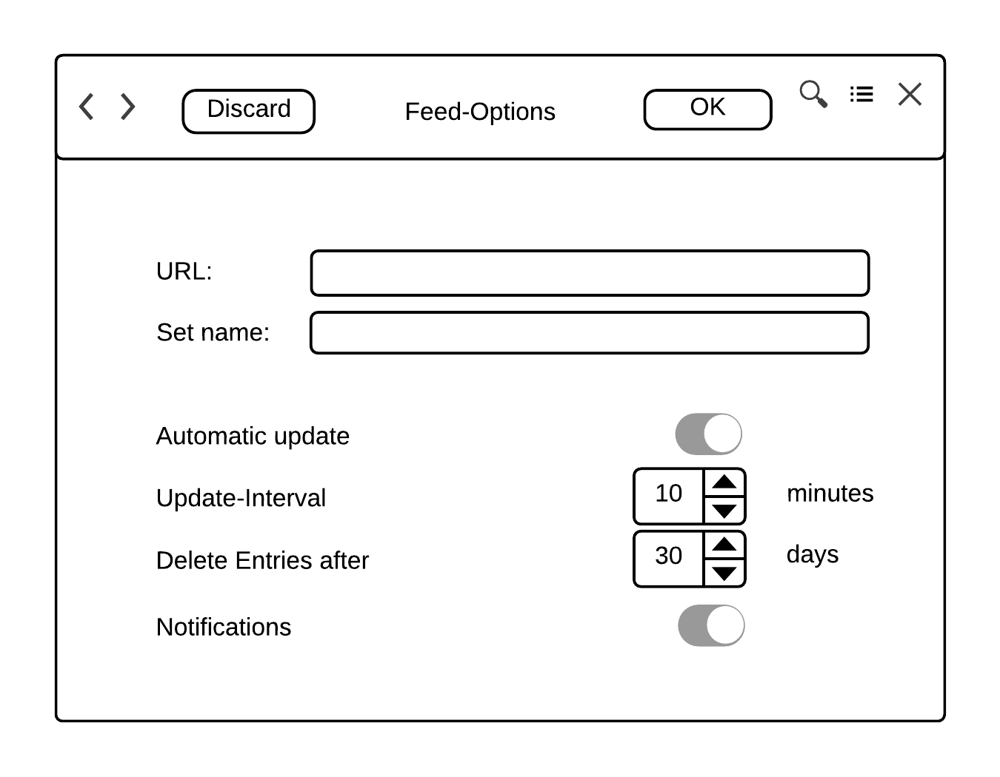
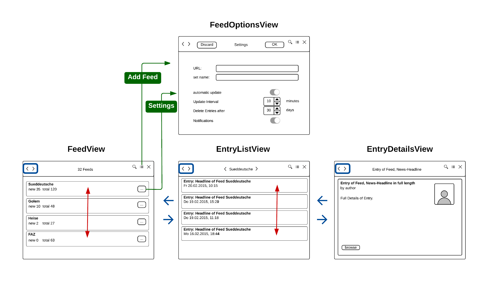

.. _entwurfGUI:

******************************
Entwurf der Benutzeroberfläche
******************************

Überlegungen und Grundkonzept
=============================

Ziel ist es, die gestellten Anforderungen an die Benutzeroberfläche zu erfüllen.
Primäre Anforderungen sind:

 * Minimalistisches Design
 * Kompaktheit
 * Einfachheit der Bedienung
 * Innovatives Navigationskonzept
 * Responsive Design
 * Grundsätzliche Einhaltung der GNOME Human Interface Guidelines

Ein minimalistisches Design soll dadurch erreicht werden, dass lediglich die
wichtigen Bestandteile dargestellt werden. Auf unnötige Spielereien wird
verzichtet. Es wird eine klare, übersichlich strukturierte Oberfläche entworfen.

Das Ausmaß der GUI wird exakt einer Ansicht entsprechen und dadurch die
geforderte Kompaktheit erfüllen. Es wird immer genau ein Thema dargestellt.
Keine Verschachtelung verschiedener Fenster. Das bietet einerseits den Vorteil, 
leicht die Übersicht zu behalten und andererseits kann diese GUI leicht in einen
Tiling-Window-Manager integriert werden.

Die Einfachheit der Bedienung wird beispielsweise dadurch erreicht, dass dem Benutzer
bekannte Shortcuts zur Verfügung gestellt werden. Grundsätzlich wird die
Einfachheit umgesetzt, indem eine intuitive Bedienung angeboten wird. So ist der
Wechsel zwischen den Ansichten mit den Pfeiltasten möglich. 

Die Navigation mit der Tastatur stellt ebenso die einfache sowie effiziente Bedienung
sicher und ist Bestandteil des innovativen Navigationskonzepts. Das
Navigationskonzept wird in diesem Kapitel noch separat behandelt.

Um die Forderung nach Responsive Design zu erfüllen, bekommt der Benutzer
ausreichend Feedback zu den ausgeführten Aktionen. Treten beispielsweise beim
Hinzufügen eines Feeds Fehler auf, wird der Benutzer mit einem Hinweis darauf
aufmerksam gemacht.

.. _scratchMainWindow:

    
    Mockup des *MainWindows*.

Das Grundkonzept der Benutzeroberfläche beruht auf dem in Abbildung :num:`scratchMainWindow` dargestellten *MainWindows*. Das *MainWindow* 
verwaltet den Stack, der die verschiedenen Ansichten darstellt. Die
Ausmaße des Fensters betragen beim Start von *gylfeed* standardmäßig 
800x600 Pixel. Eine individuelle Anpassung der Fenstergröße ist möglich.

Die Ansichten
=============

Um einen ersten Eindruck von der geplanten Benutzeroberfläche zu erhalten, wurden
Mockups der einzelnen Ansichten erstellt. Jede der Ansichten wird kurz
erläutert.

Anzeige der Feeds - *Feedview*
------------------------------

.. _scratchFeedView:

.. figure:: ./figs/scratchFeedview.png
    :alt: Mockup der Ansicht FeedView.
    :width: 80%
    :align: center
    
    Mockup der Ansicht *FeedView*.

Abbildung :num:`scratchFeedView` zeigt den Entwurf der Ansicht *FeedView*

Mit der *Feedview* soll nicht nur die erste Ansicht, sondern der Grundaufbau
der kompletten GUI näher betrachtet werden. In der Header Bar sind global
zugängliche Funktionaliäten enthalten. Der View Switcher, Such-Button,
Menü-Button und Exit-Button. Mit dem View Switcher ist das Navigieren
zwischen den Ansichten mit Maus möglich. Der Search-Button öffnet einen
Revealer innerhalb der jeweiligen Ansicht und ermöglicht die Suche innerhalb
dieser Ansicht. Der Menü-Button öffnet ein Menü mit weiteren
Auswahlmöglichkeiten, die in Abbildung :num:`scratchMenue` näher betrachtet werden. Der
Exit-Button schließt das Programm. In der Mitte der Header Bar kann ein Titel
dargestellt werden. Dieser wird an die jeweilige Ansicht angepasst. Wird
aktuell die *Feedview* dargestellt, wird die Anzahl der Feeds angezeigt.

Innerhalb der *Feedview* selbst ist eine Listbox enthalten, die wiederum
Listbox Rows enthält. In einer Listbox Row wird der Titel des Feeds und 
Labels für die Anzeige von neuen/ungelesenen/kompletten Nachrichten angezeigt
. Jede Listbox Row enthält einen Settings-Button. Dieser öffnet die Ansicht
*FeedOptionsView*. Die Ansicht ist scrollbar.

Suche innerhalb einer Ansicht
-----------------------------

Abbildung :num:`scratchSearch` zeigt den Entwurf der Feedansicht mit 
aktivierter Suchfunktion. In diesem Fall verschiebt ein Revealer die
angezeigten Feeds nach unten und schafft Platz für die Suchleiste.

.. _scratchSearch:

    
    Mockup der Ansicht *FeedView* mit aktivierter Suchfunktion.

   
Ansicht der Settings - *FeedOptionsView*
----------------------------------------

Abbildung :num:`scratchOptions` zeigt den Entwurf der Ansicht Settings.
Diese Ansicht wird verwendet, um neue Feeds hinzuzufügen, oder die
Einstellungen eines bereits vorhandenen Feeds anzuzeigen und Änderungen
vorzunehmen. Für diese Ansicht wird in der Header Bar ein zustimmender und
ein ablehnender Button hinzugefügt. Je nach Funktion der Ansicht, führen
diese Buttons andere Aktionen aus. Dem Benutzer wird dies durch entsprechende
Beschriftungen deutlich gemacht. Die Ansicht enthält die Eingabefelder für
die URL des Feeds und den Namen des Feeds. Einstellungen sind: automatisches
Update (ja/nein), Update-Intervall (Regler in Minuten), Zeitraum nachdem 
Nachrichten gelöscht werden (Regler in Tagen) und Notifications (ja/nein).

.. _scratchOptions:

    
    Mockup der Ansicht *FeedOptionsView*.

Ansicht von Entries - *EntryListView*
-------------------------------------

Abbildung :num:`scratchEntries` zeigt den Entwurf der Ansicht von Entries.
Die Entries werden in Listbox Rows innerhalb einer Listbox dargestellt. Eine
Listbox Row enthält die Daten eines Entry, also einer Nachricht. Es wird der
Titel der Nachricht und der Zeitstempel angezeigt. In der Header Bar wird als
Titel der Name des Feeds angezeigt. Die Ansicht ist scrollbar.

.. _scratchEntries:

    
    Mockup der Ansicht *EntryListView*.

Detailansicht eines Entry - *EntryDetailsView*
----------------------------------------------

Abbildung :num:`scratchDetails` zeigt den Entwurf der Detailansicht eines
Entry. Wird ein bestimmter Entry ausgewählt, wird er in dieser Ansicht
detailliert dargestellt. Es wird der Titel, der Plot und mögliches
Bildmaterial angezeigt. Diese Ansicht ermöglicht das Öffnen von Links direkt
innerhalb der selbigen. So kann beispielsweise der eigentliche Artikel
innerhalb dieser Ansicht angezeigt werden.

.. _scratchDetails:

.. figure:: ./figs/scratchDetails.png
    :alt: Mockup der Ansicht EntryDetailsView.
    :width: 70%
    :align: center
    
    Mockup der Ansicht *EntryDetailsView*.

Inhalt des Menüs
----------------

Abbildung :num:`scratchMenue` zeigt den Entwurf der Feedansicht mit 
geöffnetem Menü. Im Menü können die Aktionen *update*, *add Feed*, 
*about gylfeed* oder *Close Window* ausgeführt werden. Das sind Aktionen,
die von jeder Ansicht aus ausgeführt werden können sollen und deshalb
global zugänglich in der Header Bar angeboten werden. Sollten während
der Entwicklung von *gylfeed* weitere globale Aktionen hinzukommen, ist
die Erweiterung des Menüs problemlos möglich. Für diese Aktionen werden
Shortcuts angeboten, die in der Abbildung bereits beispielhaft dargestellt
sind.

.. _scratchMenue:

.. figure:: ./figs/scratchMenue.png
    :alt: Mockup der FeedView mit geöffnetem Menü.
    :width: 70%
    :align: center
    
    Mockup der *FeedView* mit geöffnetem Menü.

 
Navigationskonzept
==================

Der Inhalt der einzelnen Ansichten wurde vorgestellt. Ergänzend soll nun in
Abbildung :num:`navikonzept` die
Navigation zwischen den einzelnen Ansichten dargestellt werden. Im Zuge
dessen wird das Konzept der Interaktion, d.h. auf welche Weise navigiert 
werden kann, verdeutlicht.

.. _navikonzept:

    
    Navigationskonzept von *gylfeed*.

Zwischen *FeedView*, *EntryListView* und *EntryDetailsView* ist die
Navigation mit Pfeiltasten oder alternativ über den ViewSwitcher in der 
Header Bar möglich (blau dargestellt). Zur *FeedOptionsView* kann zentral über den Menü-Button
in der Header Bar navigiert werden. Durch die Auswahl von *add Feed* wird
die *FeedOptionsView* augerufen (grüner Pfeil mit Beschriftung "add Feed"). Der Aufruf der *FeedOptionsView* über
den Settings-Button innerhalb der *FeedView* zeigt die Daten und
Einstellungen eines Feeds an (grüner Pfeil mit Beschriftung "Settings"). 
Innerhalb von *FeedView* und *EntryListView* ist der Wechsel zwischen den
einzelnen Rows über die Pfeiltasten möglich (rot dargestellt).

