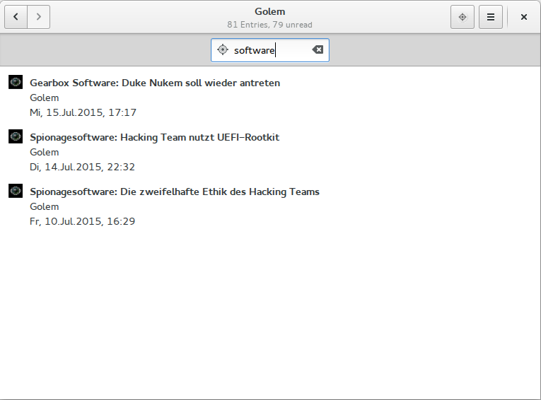

.. _weiterfuehrendekonzepte:

***********************
Weiterführende Konzepte
***********************

Innerhalb der Projektarbeit *Entwurf und Implementierung eines Feedreaders*
(vgl. :cite:`kiessling`)
wurden bereits mögliche Verbesserungen und Erweiterungen für den Feedreader
*gylfeed* vorgeschlagen. Im Folgenden wird die Suchfunktion und der Einbezug von
Nutzer-Präferenzen näher betrachtet.

Ausbau der Suchfunktion
=======================

In der aktuellen Version von *gylfeed* wird eine lineare Suche angewandt. Es
ist möglich nach einem Feed oder dem Titel einer Nachricht zu suchen. Abbildung
:num:`suchleiste` zeigt die implementierte Suchfunktion. Der Suchbegriff
*software* ist in drei der durchsuchten Nachrichten-Titeln enthalten. Wie die
Suchergebnisse zeigen, wird der Suchbegriff sowohl in Groß- als auch in
Kleinschreibung gefunden. Bevor zwischen Suchanfrage und Datenbestand aus
Nachrichten ein einfacher String-Vergleich stattfindet, werden beide
Zeichenketten mit der Funktion *lower()* in Kleinschreibung vereinheitlicht.

.. _suchleiste:

    
    Die Suchfunktion von gylfeed, Suche innerhalb der Nachrichten des Feeds
    *Golem*.

.. raw:: Latex

   \newpage
    
Code der implementierten Suchfunktion:
    
.. code-block:: python

   def _filter_function(self, row):
        query = self.search_term.lower()
        if not query:
            return True
        return query in row.get_title().lower()

Das Problem dieser Implementierung ist, dass bereits bei einem abweichenden
Zeichen keine Übereinstimmung gegeben ist und das Suchergebnis deshalb
unvollständig oder die Suche komplett erfolglos bleibt. Aus diesem Grund ist es
erstrebenswert, eine fehlertolerante Implementierung zu finden. Um trotz
Tippfehler, Buchstabendreher, falscher Rechtschreibung und Ähnlichem zum
gewünschten Suchergebnis zu kommen, gibt es entsprechende Algorithmen.

Eine mögliche Lösung bietet das Modul *difflib* der Python Standardbibliothek
(vgl. :cite:`difflib` -- Dokumentation von difflib). Dem liegt der
Ratcliff-Obershelp Algorithmus zugrunde. Der von John W. Ratcliff und D. E.
Metzener entwickelte Algorithmus sucht die größte übereinstimmende Sequenz
zweier Zeichenketten. Das wird für alle übrigen Zeichen rechts und links der
übereinstimmenden Sequenz durchgeführt, solange bis keine Zeichen mehr übrig
sind. Das Ergebnis des Vergleichs wird aus dem Zweifachen der Summe aller
gefundenen Sequenzen, dividiert durch die Summe der Zeichen beider
Zeichenketten, berechnet (vgl. :cite:`ratcliff`). Folgendes einfache Beispiel zeigt die Anwendung des
Algorithmus für die Zeichenketten *grafik* und *graphik*.

.. math::

    \frac {2\times(3+2)}{(6+7)} \approx 0,77 ~ (Übereinstimmende~Sequenzen: ~gra~ und ~ik~)

Der Ratcliff-Obershelp Algorithmus hat eine Komplexität von :math:`O(n^{3})` im
schlechtesten Fall und eine zu erwartende Komplexität von :math:`O(n^{2})`.

Alternativ soll der Damerau-Levenshtein Algorithmus betrachtet werden. Hierbei
handelt es sich um ein Distanzmaß. Es werden die notwendigen Editiervorgänge
gezählt, die es benötigt, um zwei übereinstimmende Zeichenketten zu erhalten.
Editiervorgänge sind das Löschen, Ersetzen oder Einfügen von Zeichen (vgl.
:cite:`bard2007spelling`).
Zusätzlich erkennt der Algorithmus vertauschte Zeichen. Das unterscheidet den
Damerau-Levenshtein Algorithmus vom reinen Levenshtein Algorithmus. Der
Vergleich der Zeichenketten *grafik* und *graphik* ergibt eine Editierdistanz
von 2. Im ersten Schritt wird ,,f`` durch ,,p`` ersetzt und anschließend ,,h``
entfernt. Um diese Editierdistanz besser mit dem Ergebnis anderer Algorithmen
vergleichen zu können, gibt es die normalisierte Damerau-Levenshtein-Distanz.

Der Damerau-Levenshtein Algorithmus hat eine Komplexität von :math:`O(nm)`, mit m und n
als jeweilige Länge der Zeichenketten.

Für beide Algorithmen gibt es eine Implementierung in Python. Die folgende
interaktive Python-Sitzung zeigt die Ausführung der Algorithmen.

.. code-block:: python

   >>> import difflib
   >>> from pyxdameraulevenshtein import normalized_damerau_levenshtein_distance 
   >>> from pyxdameraulevenshtein import damerau_levenshtein_distance
   
   >>> difflib.SequenceMatcher(None, "grafik", "graphik").ratio()
   0.7692307692307693
   >>> damerau_levenshtein_distance("grafik", "graphik")
   2
   >>> normalized_damerau_levenshtein_distance("grafik", "graphik")
   0.2857142857142857
   >>> 1 - normalized_damerau_levenshtein_distance("grafik", "graphik")
   0.7142857142857143

Der vom Python-Modul *difflib* errechnete Wert stimmt mit dem eben manuell berechneten
Ratcliff-Obershelp Wert von 0.77 überein. Auch die Ausführung des
Damerau-Levenshtein Algorithmus ergibt die manuell errechnete Editierdistanz von
2. Im Anschluss wurde die normalisierte Damerau-Levenshtein-Distanz berechnet.
Da ein Wert von 0.0 völlige Übereinstimmung und 1.0 keinerlei Übereinstimmung
entspricht, wird der errechnete Wert im nächsten Schritt von 1 subtrahiert. Das
ermöglicht den Vergleich mit dem Ergebnis des Ratcliff-Obershelp Algorithmus. Es
ist zu erkennen, dass beide Werte nahe beieinander liegen. Ratcliff-Obershelp
errechnet eine minimale höhere Übereinstimmung der Zeichenketten *grafik* und
*graphik*.

Wie können diese Algorithmen die Suchergebnisse innerhalb von *gylfeed*
verbessern. Ausgehend von der Annahme, es werden Übereinstimmungen bis zu einem
Wert von 0.60 als Suchtreffer angezeigt, würden innerhalb von *gylfeed* nicht
nur Schlagzeilen, die genau *grafik* enthalten angezeigt, sondern auch
diejenigen, die die Schreibweise *graphik* verwenden. Das ist auf sämtliche
andere Fälle übertragbar und die Fehlertoleranz beliebig anpassbar. Die
Erweiterung der Suche mit Hilfe der vorgestellten Algorithmen bietet dem
Benutzer demnach einen größeren Komfort.

Welcher der beiden Algorithmen zu bevorzugen ist, darüber lässt sich nur
schwierig eine allgemeine Aussage treffen. Damerau-Levenshtein hat zumindest
aufgrund der geringeren Laufzeit-Komplexität einen Performance-Vorteil. 

Bei relativ großen Datenmengen ist die Laufzeit-Komplexität des
Damerau-Levenshtein Algorithmus von  :math:`O(nm)`, dennoch als problematisch
anzusehen. Hier wären ergänzende Suchstrategien anzuraten, die zu einer besseren
Performance führen.

Zur Demonstration der beiden Algorithmen wurde
lediglich ein einfaches Beispiel gewählt. In der realen Anwendung ist der
Sachverhalt wesentlich komplexer, da ganze Phrasen und nicht nur zwei Wörter
verglichen werden müssen. Müsste beispielsweise das Wort *grafik* innerhalb der
Phrase *Die Bevölkerungszahlen als Grafik* gesucht werden, wären mehrere
Wörter zu vergleichen, bis die Übereinstimmung gefunden wird.

Einbezug von Nutzer-Präferenzen
===============================

Anders als bei E-Mails kann der Empfänger von Feed-Nachrichten bestimmen,
welche Feeds er lesen möchte. Trotzdem kann es ab einer relativ großen Menge an
Feeds hilfreich sein, vorgeschlagen zu bekommen, welche Nachrichten von
besonderem Interesse sein könnten.

Es gibt verschiedene Möglichkeiten, die Präferenzen des Nutzers mit
einzubeziehen. Der Nutzer könnte beispielsweise eine Stichwortliste mit
bevorzugten Themen führen. Anhand dieser Liste würden neue Nachrichten als
relevant oder weniger relevant eingestuft.

Relevanz-Feedback durch den Nutzer ist eine weitere Möglichkeit, Informationen
über die Präferenzen des Nutzers zu sammeln. Nach dem Lesen einer Nachricht
würde der Nutzer seine persönliche Wertung abgeben. Das erfordert jedoch
explizit Mitarbeit vom Nutzer und kann nicht implizit im Hintergrund ablaufen.

Auch das bisherige Leseverhalten des Nutzers kann mit einbezogen werden. Aus den
bisher gelesenen Nachrichten könnte eine Dokumenten-Kollektion gebildet werden,
die
zum Vergleich mit neuen Nachrichten herangezogen wird.

Um zu bewerten, ob der vorliegende Text dem bisherigen Leseverhalten und den
Präferenzen des Nutzers entspricht, können sogenannte *Klassifikatoren* eingesetzt
werden. Als Beispiel soll der *naive Bayes-Klassifikator*
betrachtet werden. Dieser Klassifikator wird beispielsweise bei der
Erkennung von *Spam*-E-Mails eingesetzt. Thomas Runkler schreibt in *Data
Mining: Methoden und Algorithmen intelligenter Datenanalyse*, ein naiver
Bayes-Klassifikator ist ein wahrscheinlichkeitsbasiertes
Klassifikationsverfahren, das auf dem Satz von Bayes basiert (vgl.
:cite:`runkler2010data`). Der Satz von Bayes sieht wie folgt aus:

.. math::

    P(R|D) = \frac {P(D|R) \cdot P(R)} {P(D)}

Es wird die Wahrscheinlichkeit *P* für die Relevanz *R* bezüglich eines
gegebenen Dokuments *D* berechnet.

Einen Klassifikator an sich beschreiben Dumais et al. als Funktion, die einen
gegebenen Vektor aus Attributen einer Wahrscheinlichkeit, dass diese Attribute
zu einer bestimmten Klasse gehören, zuordnet (vgl. :cite:`dumais`). Attribute
wären in diesem Fall die Worte innerhalb eines Dokuments, also einer
Feed-Nachricht. Die Wahrscheinlichkeit, die ein Klassifikator berechnet, gibt
demnach an, mit welcher Wahrscheinlichkeit das zu bewertende Dokument zu den
Vergleichsdaten (einer Klasse) passt. Dazu benötigt es Trainingsdaten. Der
Klassifikator lernt anhand dieser Trainingsdaten, welche Dokumente relevant und 
welche weniger relevant sind. Im Fall von *gylfeed* könnten bereits gelesene
Nachrichten als Trainingsdaten verwendet werden.

Der Einsatz eines Klassifikators benötigt gerade bei der Auswahl der
Trainingsdaten umfangreiche Tests und Anpassungen. Hier soll lediglich die
grundsätzliche Idee dahinter vorgestellt werden.

In Python gibt es beispielsweise das Modul *TextBlob*, das die Anwendung des
naiven Bayes-Klassifikators unterstützt (vgl. :cite:`blob`). Folgender
Beispiel-Code zeigt die Anwendung des Moduls:

.. code-block:: python

    from textblob.classifiers import NaiveBayesClassifier

    train_data = [
        ("Verschlüsselung, die neuen Trends","pos"),
        ("Spionagesoftware: Hacking Team nutzt UEFI-Rootkit", "pos"),
        ("Systemverschlüsselung: Yubikeys unter Linux nutzen", "pos"),
        ("Aktuelles zu PGP Verschlüsselung", "pos"),
        ("Festplatten-Verschlüsselung leicht gemacht", "pos"),
        ("Frische Kuchen mit Früchten", "neg"),
        ("Neueste Trends beim Backen", "neg"),
        ("Backen als Hobby entdeckt", "neg"),
        ("Kochen zur Entspannung", "neg"),
    ]

    test_data = [
        ("Verschlüsselung für Anfänger"),
        ("Entwicklung neuer Verschlüsselungs-Algorithmen"),
        ("Linux-Community unterstützt Yubikey-Entwicklung"),
        ("Die neuesten Kuchen des Sommers"),
        ("Backen für jedermann"),
        ("Kochen mit Begeisterung"),
        ("Die besten Nudel-Rezepte"),
    ]

    nbc = NaiveBayesClassifier(train_data)

    for data in test_data:
         print(data+" = "+nbc.classify(data))

    Ergebnis:
    Verschlüsselung für Anfänger = pos
    Entwicklung neuer Verschlüsselungs-Algorithmen = pos
    Linux-Community unterstützt Yubikey-Entwicklung = pos
    Die neuesten Kuchen des Sommers = neg
    Backen für jedermann = neg
    Kochen mit Begeisterung = neg
    Die besten Nudel-Rezepte = pos
    

Die Trainingsdaten werden im Code-Beispiel innerhalb der Liste *train_data*
verwaltet. Dabei wird jedem Trainingsdatensatz eine Relevanz zugewiesen. Die
Trainingsdatensätze sind in diesem Fall mögliche Beispiel-Nachrichten, die bei
Relevanz mit *pos* und keiner Relevanz mit *neg* bewertet werden. Diese
Trainingsdaten werden dem Modul *NaiveBayesClassifier* übergeben. Im nächsten
Schritt werden dem Klassifikator Test-Nachrichten zum Klassifizieren übergeben.
Anhand der Trainingsdaten könnte man unterstellen, dass eine gewisse Präferenz
für Themen aus dem Bereich Verschlüsselung und kein Interesse für Kochen und Backen vorliegt.
Betrachtet man das Ergebnis des Klassifikators, kann man feststellen, dass
Themen betreffend Verschlüsselung als relevant und Themen, die Backen und Kochen
betreffen, als nicht relevant klassifiziert wurden. Lediglich die letzte
Test-Nachricht *Die besten Nudel-Rezepte* gehört zum Themenbereich Kochen und
hätte somit als nicht relevant klassifiziert werden müssen. Anhand dem geringen
Umfang der Testdaten konnte dies aber nicht erkannt werden.

Die Präferenzen des Nutzers können sich im Laufe der Zeit ändern. Klassifikation
mit dem naiven Bayes-Klassifikator benötigt viele Trainingsdaten und ist eher für eine
längere Beobachtung der Nutzer-Präferenzen ausgelegt. Daniel Billsus und Michael
J. Pazzani haben aus diesem Grund ein hybrides Modell aus Nearest Neighbor
Algorithm für kurzzeitige Präferenzen und den naiven Bayes-Klassifikator für
langfristige Präferenzen entwickelt (vgl. :cite:`hybrid`).

