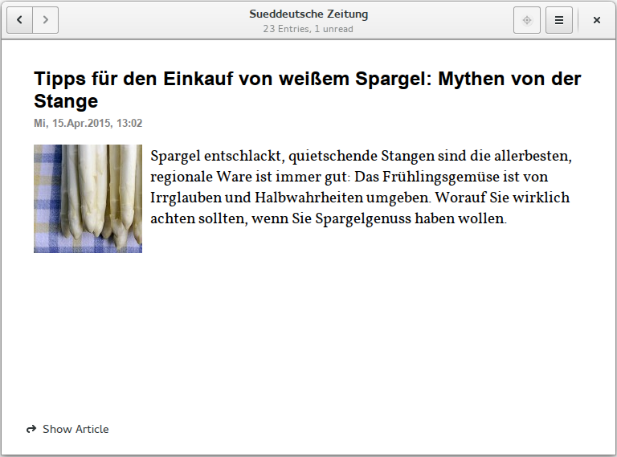

***************
Implementierung
***************

Dieses Kapitel wird einen Eindruck von der Umsetzung der 
Entwürfe von Architektur und Benutzeroberfläche geben. Eine detailliertere
Analyse der verwendeten Algorithmik und Umsetzung, ist Teil der Bachelorarbeit.

Grundsätzliches
===============

Bevor auf Details der Implementierung eingegangen wird, soll kurz erläutert
werden, welche Programmiersprache für das Projekt gewählt wurde. Ebenso 
werden sämtliche Werkzeuge, die zur Umsetzung der Projektarbeit verwendet
wurden, vorgestellt. 

**Programmiersprache:** Das Projekt wird mit der Programmiersprache Python in
der Version 3.3 umgesetzt. Einerseits, weil Python zahlreiche Vorteile - 
vorallem bei relativ kurzem Entwicklungszeitraum - bietet und andererseits, weil sich 
hiermit im Zuge der Projektarbeit die Möglichkeit ergibt, eine weitere Programmiersprache zu erlernen.
Die wichtigsten Vorteile von Python, u.a. erwähnt in *Learning Python* 
von Mark Lutz :cite:`LutzLearningPython`, zusammengefasst:

.. aufzeahlung python vorteile
   
:Umfangreiche Standardbibliothek:
     Python bietet eine umfangreiche Standardbibliothek. Aufgrund des
     begrenzten Projektzeitraums ist dies ein großer Vorteil. Neben der 
     Standardbibliothek verfügt Python über zahlreiche Erweiterungen von
     Drittanbietern.

:Kompatibel mit GTK:
     Python erlaubt es, die grafische Benutzeroberfläche mit GTK umzusetzen,
     dies ist eine Anforderung an *gylfeed*.

:Qualität der Software:
     Python erleichtert es, leicht lesbaren und wartbaren Quellcode zu
     erstellen.

:Produktivität:
     Mit Python ist nur etwa ein Drittel bis ein Fünftel des Quellcode-
     Umfangs von C, C++, oder Java nötig, um vergleichbare Ergebnisse
     zu erzielen.

:Portabilität:
     Für *gylfeed* ist somit bereits die Grundlage geschaffen, zukünftig
     neben Linux auf andere Plattformen verfügbar zu sein.
 
**Tool für die Erstellung der GUI:**

Für die Erstellung der grafischen Benutzeroberfläche wird GTK, das GIMP
Toolkit, in der Version 3.14 verwendet. GTK ist plattformunabhängig, dies
bietet den Vorteil, dass *gylfeed* zu einem späteren Zeitpunkt für andere
Plattformen, außerhalb Linux, angeboten werden kann. GTK bietet eine leicht
anwendbare, jedoch mächtige API. Für die Umsetzung innerhalb der
Projektarbeit wurde auf den Einsatz eines GUI-Builders verzichtet, um GTK
von Grund auf zu erlernen und anzuwenden.

   
**Entwicklungssytem:**
Die Software *gylfeed* wird unter der Linux Distribution *Fedora 21* entwickelt. Für die Entwicklung wird der
Editor *gVim* verwendet. Zusätzlich werden Python--Plugins zur Validierung 
der Python PEP--Stilrichtlinien (siehe :cite:`PEP`) verwendet. 
Als weiteres Werkzeug
wird die interaktive Python Shell *bpython* eingesetzt 
(siehe :cite:`bpython`). Das erlaubt das 
Testen von Funktionalitäten außerhalb des eigentlichen Quelltextes.

**Quellcodeverwaltung:**
Zur Verwaltung des Quellcodes wird *git*, ein Versionsverwaltungssystem,
eingesetzt. Der Quellcode selbst wird auf dem Hosting--Dienst für
Software--Entwicklungsprojekte *GitHub* (siehe :cite:`github`) gelagert. Das
Projekt ist über folgenden Link zur GitHub-Webseite erreichbar:

    * https://github.com/nanamii/gylfeed/ 

**Projektumfang:**
Der Projektumfang beträgt ca. 2000 *Lines of Code*,  hinzu kommt noch
die Onlinedokumentation. Eine Statistik zum Projekt, welche mit dem Tool
*cloc* erstellt wurde, ist im Anhang unter :ref:`ref-cloc` zu finden.

Implementierte Anforderungen
============================

Die Anforderungen aus Kapitel :ref:`anforderungen` wurden in vollem Umfang implementiert. Es
wurde in der Weise entwickelt, dass zur Abgabe der Projektarbeit eine
lauffähige Software vorliegt. Selbstverständlich sind noch weitere
Funktionalitäten denkbar, die innerhalb des beschränkten Projektzeitraums
nicht umgesetzt werden konnten. Auf Erweiterungen, die noch denkbar sind,
wird in der Zusammenfassung eingegangen.

Implementierung der Klassen
---------------------------

Die Klassen wurden anhand des Klassendiagramms in Abbildung 
:num:`klassendiagramm` implementiert. Der Quellcode ist unter der bereits
genannten GitHub-Webseite abrufbar.

Download mit *libsoup*
----------------------

Der Download der Daten wird mit der Bibliothek *libsoup* umgesetzt. 
*libsoup* ist eine client-/serverseitige HTTP-Bibliothek und ermöglicht
innerhalb *gylfeed* das asynchrone Herunterladen der Feed-Daten (siehe 
:cite:`libsoup`).  

Die im Folgenden aufgeführte Bibliothek *Universal Feedparser* ermöglicht zwar
das direkte Herunterladen und anschließende Parsen eines Feeds, jedoch nur
synchron. Eine Anforderung an *gylfeed* ist, dass das Herunterladen der Daten
andere Prozesse nicht behindert. Werden die Daten synchron heruntergeladen,
blockt dies solange, bis der Download abgeschlossen ist. Aus diesem Grund erfolgt
eine Trennung zwischen Download und Parsen der Daten. Der Download erfolgt mit
*libsoup*, das Parsen mit *Universal Feedparser*.

Parsen mit *Universal Feedparser*
---------------------------------

Zum Parsen der heruntergeladenen Daten wird die externe Bibliothek *Universal
Feedparser* in der Version 5.1.3 verwendet. Die Bibliothek ermöglicht das
Parsen folgender Formate: RSS 0.90, 0.91, 0.92, 0.93, 0.94, 1.0, 2.0; 
Atom 0.3 und 1.0; CDF (Common Data Format). 

In *Developing Feeds with RSS and Atom* (siehe :cite:`DFRA`) erwähnt Ben
Hammersley den *Universal Feedparser* als 
hervorragend umgesetzten und großartig dokumentierten Feedparser. Tatsächlich
kann beim Benutzen des *Universal Feedparser* festgestellt werden, dass eine
ordentliche Dokumentation vorliegt (siehe :cite:`FPD` - Online Dokumentation).

Der *Universal Feedparser* ermöglicht das Parsen eines Feeds auf folgende
drei Arten:
 * Parsen des Feeds über die URL: Der Feedparser übernimmt hier auch das 
   Herunterladen der Daten, jedoch nur synchron.
 * Parsen des Feeds aus einer lokal gespeicherten Datei
 * Parsen des Feeds aus einem String

Alle drei Wege liefern ein Objekt vom Typ feedparser.FeedParserDict. Es
handelt sich um ein Dictionary mit den geparsten Feed-Daten.

Folgendes Code-Beispiel einer bpython-Sitzung soll die Grundfunktionaliät 
*parse* demonstrieren.

.. code-block:: python

    import feedparser

    # Der Funktion *parse* wird die URL vom Feed der 
    # Sueddeutschen Zeitung übergeben und der Variable *feed_dict* zugewiesen
    >>> feed_dict = feedparser.parse("http://suche.sueddeutsche.de/?output=rss")

    # Zugriff auf den Wert, des Schlüssels *title*
    >>> feed_dict["feed"]["title"]

    # Ausgabe: Titel des Feeds der Sueddeutschen Zeitung
    'Alle Artikel - Nachrichten aus Politik, Wirtschaft und Sport' 

In Anhang :ref:`dict` ist die komplette Struktur des Dictionary zu sehen. Innerhalb
*gylfeed* ist dieses Dictionary Teil eines jeden Feedobjekts. Grundsätzlich
handelt es sich um ein Dictionary, d.h. eine Datenstruktur aus Schlüssel-
Wert-Paaren. Der Wert *entries* innerhalb dieses Dictionaries enthält als 
Schlüssel wiederum eine Liste aus
Dictionaries. Ein solches Dictionary repräsentiert einen *Entry*. Auch der
Schlüssel *feed* hat als Wert ein Dictionary. Darin sind die Daten zum *Feed*
enhalten.

Durch den Einsatz des *Universal Feedparsers* wird das in Kapitel
:ref:`FazitKapitel2` erwähnte Problem der individuellen Behandlung von
verschiedenen Feed-Formaten teilweise gelöst. Der *Universal Feedparser* stellt die
Daten unabhängig vom ausgehenden Feedformat einheitlich zur Verfügung.
Dies bedeutet nicht, dass für jedes Feedformat die gleichen Daten vorliegen.
Es erleichtert lediglich den Zugriff auf die Daten.

Eingebetteter Browser mit *Webkit*
----------------------------------

Innerhalb von *gylfeed* ist es möglich, Webseiten darzustellen. Umgesetzt
wird dies mit der HTML-Rendering Engine *WebKit* (siehe :cite:`WebKit`). Die aktuelle Version von
*gylfeed* ermöglicht innerhalb der *EntryDetailsView* die Darstellung von
Webinhalten. Der Benutzer kann den originalen
Artikel zur jeweiligen Feed-Nachricht aufrufen. An dieser Stelle bieten sich
für *gylfeed* auch zukünftige Erweiterungen, die durch die Verwendung von
*WebKit* möglich sind.

Umsetzung der grafischen Benutzeroberfläche
===========================================

Im Folgenden wird die Umsetzung der grafischen Benutzeroberfläche vorgestellt
. Im Grunde wurden die Entwürfe aus Kapitel :ref:`entwurfGUI` 
(Entwurf der Benutzeroberfläche) mit GTK umgesetzt. Für Feeds,
die kein Icon liefern, wurde ein Standardicon entworfen, dass sich an das RSS
-Logo anlehnt. Auch für die Listbox Row *All Feeds* wurde ein Icon entworfen.
Entsprechende Details werden anhand der Ansichten erläutert.

Ansicht *Feedview*
------------------

Abbildung :num:`feedview` zeigt die implementierte Ansicht *Feedview*. Hier
werden die Feeds aufgelistet. Die erste *Listbox Row* ist für die
Zusammenfassung aller Feeds vorgesehen. Auch die Labels in dieser Row zeigen
die Daten der Feeds in Summe an. Es gibt pro Row drei verschiedene Labels:

**Neue Entries:** Grün dargestellt, wenn durch das Update neue Entries
hinzugekommen sind. Grün bleibt das Label solange, bis der Benutzer den
jeweiligen Feed aufgerufen hat. Dann wechselt die Farbe auf Blau, bzw. 
die Farbe, die im eingestellten Color-Scheme als Defaultwert gesetzt ist.

**Ungelesene Entries:** Immer grau dargestellt. Ist nur sichtbar, wenn der 
Focus auf der Row liegt, um die Ansicht übersichtlich zu halten. 
Im Beispiel zu sehen, bei Feed *Sueddeutsche Zeitung*, zweite Row.

**Alle Entries:** Immer grau dargestellt. Ebenfalls nur sichtbar, wenn der 
Focus auf der Row liegt.

.. _feedview:

    
    Implementierte Ansicht *Feedview*.

Jede Listbox Row enthält neben den Labels, den Namen des Feeds, das Icon des
Feeds und einen Button für weitere Optionen, rechts zu sehen. In der 
Abbildung hat bis auf den Feed *Golem-Atom* kein Feed ein Icon geliefert.
Deshalb wird für die restlichen drei Feeds das selbst erstellte Standardicon
angezeigt. Hier ist auch zu erkennen, dass Golem über das Format RSS kein
Icon liefert, über das Format Atom hingegen schon.

Der Button für weitere Optionen enthält einen sichtbaren Rand, wenn er mit
der Maus berührt wird. Dies öffnet einen Revealer, der die möglichen Optionen
anzeigt. Es kann zwischen *Settings* und *Delete Feed* gewählt werden. Wird
*Settings* ausgewählt, wird die Ansicht *FeedOptionsView*, die in Abbildung
:num:`feedoptionsview` zu sehen ist, angezeigt.

Ansicht *EntryListView*
-----------------------

.. _entrylistview:

    
    Implementierte Ansicht *EntryListView*.

Die Auswahl eines Feeds führt zur Anzeige der *EntryListView*, wie in 
Abbildung :num:`entrylistview` zu sehen ist. Die *EntryListView* zeigt
die Entries eines vorher ausgewählten Feeds an. In der Abbildung wurde
der Feed *Sueddeutsche Zeitung* ausgewählt. Dies wird in der Header Bar
als Titel angezeigt. Als Untertitel die Anzahl der Entries und die Anzahl
der davon ungelesenen. Eine Listbox Row in dieser Ansicht enthält den Titel
des Entries, Name des Feeds und den Zeitstempel. Gelesene Entries werden
zur Unterscheidung grau und minimal kleiner dargestellt. Zur Unterstützung
und schnelleren Erkennung wird rechts ein Haken angezeigt. Das wurde dezent
und minimalistisch umgesetzt. Die ersten drei Entries in der Abbildung
zeigen die Darstellung von ungelesenen Entries.

Ansicht *EntryDetailsView*
--------------------------

.. _entrydetailsview:

    
    Implementierte Ansicht *EntryDetailsView*.

Die Auswahl eines Entries führt zur Anzeige der *EntryDetailsView*, die in 
Abbildung :num:`entrydetailsview` zu sehen ist. Die *EntryDetailsView* zeigt
die Details eines Entries an. Im abgebildeten Beispiel wird der *Titel*, 
der Zeitstempel und der *Plot* des Entry angezeigt. Zusätzlich liefert hier 
der Feed *Sueddeutsche Zeitung* ein Bild. Für die Anzeige des Titels wurde
eine serifenlose Schrift gewählt. Der Plot wird standardmäßig in der 
Schriftart *Vollkorn* dargestellt. Zusätzlich sind Fallback-Schriftarten 
definiert. In der linken unteren Ecke wird für jeden Entry ein Button
angeboten, der zum ursprünglichen Artikel führt. Die dazugehörige Webseite
wird direkt innerhalb *gylfeed* geladen. Beim Berühren des Buttons mit der 
Maus, erhält der Button einen Rahmen.

Das Design dieser Ansicht ist klar strukturiert und minimalistisch gehalten.
Die Schrift ist gut lesbar. Insgesamt eine abgerundete Darstellung des
Inhalts eines Entry.

Ansicht *FeedOptionsView*
-------------------------

Abbildung :num:`feedoptionsview` zeigt die implementierte Ansicht
*FeedOptionsView*. Diese Ansicht wird sowohl für das Hinzufügen von Feeds,
als auch für die Änderung von Einstellungen eines Feeds eingesetzt.
Die Ansicht enthält Eingabefelder für die URL des Feeds und den Namen des
Feeds. Neben diesen grundlegenden Daten zum Feed, können weitere
Einstellungen vorgenommen werden. Für den automatischen Update wird ein
Switcher angeboten, der auf *An* oder *Aus* gestellt werden kann. Ist
der Switcher in der Stellung *An*, kann zusätzlich ein Update-Intervall in
Minuten gewählt werden. Dies kann stufenlos zwischen einer bis sechzig
Minuten eingestellt werden. Die Anzahl der Tage, nach denen Entries gelöscht
werden, können zwischen X und X eingestellt werden. Die letzte Einstellung,
die für einen Feed gesetzt werden kann, ist die Anzeige von 
System-Benachrichtigungen. Dafür wird ein Switcher angeboten.

Möchte der Benutzer lediglich zügig einen Feed hinzufügen, genügt die
Angabe einer URL und eines Namens. Die restlichen Einstellungen werden
mit Standardwerten besetzt.

In dieser Ansicht wird der Header Bar ein Button für eine ablehnende Aktion,
hier roter Button mit Aufschrift *Discard* und ein Button für eine
zustimmende Aktion, hier blauer Button mit Aufschrift *Apply Changes*
hinzugefügt.

.. _feedoptionsview:

.. figure:: ./figs/feedoptionsview.png
    :alt: Implementierte Ansicht *FeedOptionsView*.
    :width: 70%
    :align: center
    
    Implementierte Ansicht *FeedOptionsView*.

Darstellung der Systemnachricht
-------------------------------

Die Funktionalen Anforderungen sehen unter 4.2.2 - Optionen für Feeds, 
Notifications vor. Die Anzeige dieser Systemnachrichten betreffen zwar nicht
die Benutzeroberfläche von *gylfeed* selbst, werden dem Benutzer jedoch 
dargestellt und sollen deshalb kurz erläutert werden. Hat ein Feed neue
Nachrichten, wird dem Benutzer über einen Popup der betreffende Feed und die
Anzahl der neuen Nachrichten mitgeteilt. Hierzu wird die Bibliothek
*libnotify* verwendet. Das Popup einer solchen Nachricht ist in Abbildung 
XX zu sehen. 

Tests
=====

Während der Entwicklung von *gylfeed* wurde mit zahlreichen Feeds,
die angeboten werden, getestet. Zusätzlich wurde ein Testserver
implementiert, der automatisch generierte Nachrichten sendet. Unittest sind
zum aktuellen Zeitpunkt der Abgabe der Projektarbeit noch in Entwicklung.
Die Umsetzung ist geplant und wird anschließend beispielhaft dargestellt.

Testserver
----------

Zum Testen wurde ein Testserver implementiert, der über http://127.0.0.1:5000
erreichbar ist und Test-Feeds erstellt. Je Update, das in *gylfeed*
ausgeführt wird, werden neue Nachrichten generiert. Das ermöglicht das zügige
Testen von Funktionalitäten. Man ist weniger abhängig von den realen Feeds
und deren Veröffentlichung von Nachrichten. Für die Implementierung des
Testservers wurde ... eingesetzt.

Unittests
---------

Für das systematische Testen der Software soll das Python 
Unittest--Framework verwendet werden.

Folgendes Beispiel zeigt die grundlegende Funktionsweise:

.. code-block:: python

   def add(a, b): return a + b

   if __name__ == '__main__':
       import unittest

       class SimpleTest(unittest.TestCase):
           def test_add_func(self):
               result = add(21, 21)
               self.assertTrue(result == 42)

       unittest.main()

Das Ausführen des Beispielcodes würde folgende Ausgabe produzieren:

.. code-block:: bash

    Ran 1 test in 0.000s

    OK

Installation
============

Folgender Befehlsaufruf zeigt das Herunterladen von *gylfeed* über die
Kommandozeile:

.. code-block:: python

   git clone "https://github.com/nanamii/gylfeed.git" target

Wie bereits erwähnt liegt der Quellcode von *gylfeed* beim 
Code-Hosting-Service *GitHub*. Mit *git clone* wird das Repository mit
dem Namen *gylfeed* über den angegebenen Link in das Zielverzeichnis 
*target* gespeichert.

Mit folgendem Befehl kann *gylfeed* ausgeführt werden:

.. code-block:: python

   python3 gylfeed.py

Die Ausführung des Befehls muss innerhalb des Zielverzeichnisses geschehen,
indem die Datei gylfeed.py liegt.

