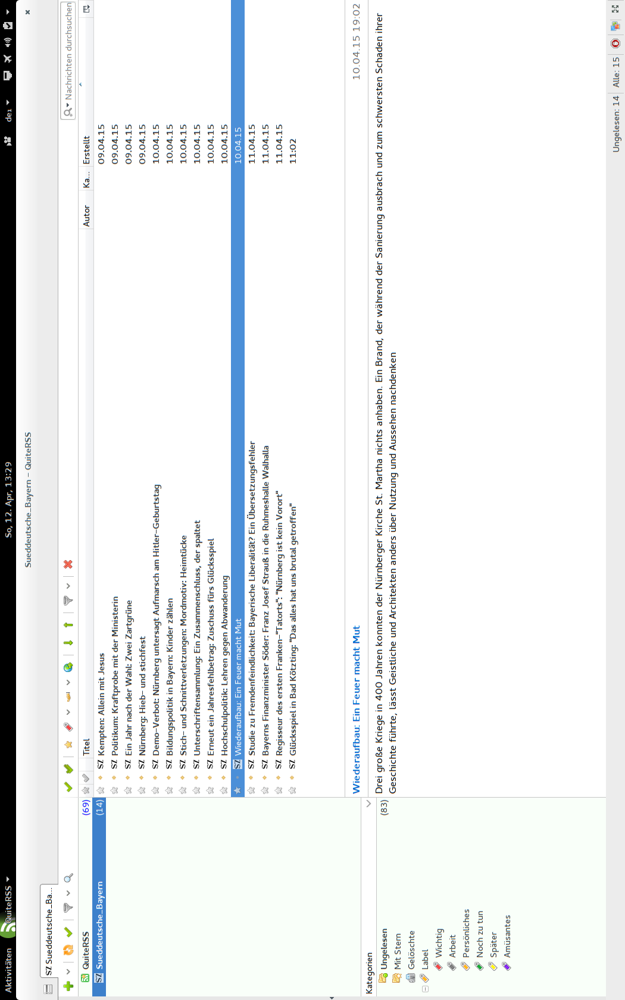
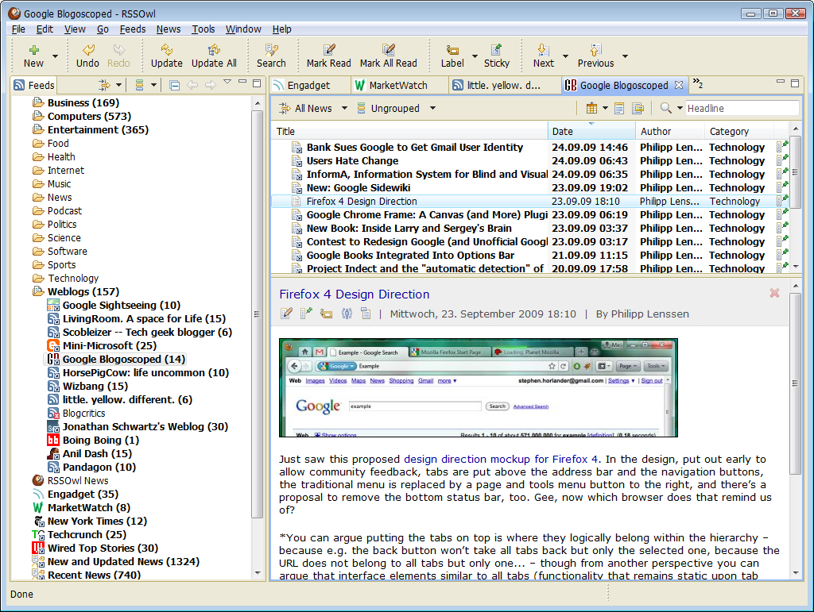
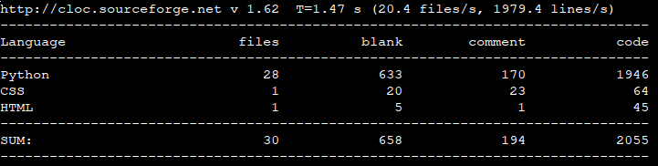

.. raw:: latex

   \appendix

.. _feedreader:

Feedreader *QuiteRSS* und *RSSOwl*
==================================

Die Feedreader *QuiteRSS* und *RSSOwl* als weitere Beispiele von 
Desktop-Feedreadern, die an den Aufbau eines Mailclients angelehnt sind.

.. _quiterss:

    
    Benutzeroberfläche des Feedreaders *QuiteRSS*.

    
    Benutzeroberfläche des Feedreaders *RSSOwl*, Quelle: http://www.heise.de/.

.. _dict:

Struktur des Feedparser-Objekts
===============================

Struktur des Feedparser-Objekts, Rückgabewert der Funktion *parse*
des *Universal Feedparsers*.

.. code-block:: xml

    {   bozo,
        bozo_exception,
        encoding,
        entries
        [
           {
            entries[i].author
            entries[i].author_detail
            entries[i].comments
            entries[i].content
            entries[i].contributors
            entries[i].created
            entries[i].created_parsed
            entries[i].enclosures
            entries[i].expired
            entries[i].expired_parsed
            entries[i].id
            entries[i].license
            entries[i].link
            entries[i].links
            entries[i].published
            entries[i].published_parsed
            entries[i].publisher
            entries[i].publisher_detail
            entries[i].source
            entries[i].summary
            entries[i].summary_detail
            entries[i].tags
            entries[i].title
            entries[i].title_detail
            entries[i].updated
            entries[i].updated_parsed
            entries[i].vcard
            entries[i].xfn
            }
        ]
        etag
        feed
            {
            feed.author
            feed.author_detail
            feed.cloud
            feed.contributors
            feed.docs
            feed.errorreportsto
            feed.generator
            feed.generator_detail
            feed.icon
            feed.id
            feed.image
            feed.info
            feed.info_detail
            feed.language
            feed.license
            feed.link
            feed.links
            feed.logo
            feed.published
            feed.published_parsed
            feed.publisher
            feed.publisher_detail
            feed.rights
            feed.rights_detail
            feed.subtitle
            feed.subtitle_detail
            feed.tags
            feed.textinput
            feed.title
            feed.title_detail
            feed.ttl
            feed.updated
            feed.updated_parsed
            }
        headers
        href
        modified
        namespaces
        status
        version
    }

.. _cloc:

Projektstatistik
================

Mit *cloc* erstellte Statistik des Projekts.

    
    Mit dem Tool *cloc* erstellte Projektstatistik.

.. _testserver:

Implementierung des Testservers
===============================

Der Python-Code der Implementierung des Testservers.

.. code-block:: python
 
    from flask import Flask, request
    from werkzeug.contrib.atom import AtomFeed
    from urllib.parse import urljoin
    from faker import Factory
    import datetime

    app = Flask(__name__)
    faker = Factory.create('de_DE')

    class Article:
        def __init__(self):

            self.title = faker.sentence(nb_words=3, variable_nb_words=True)
            self.url = faker.uri()
            self.rendered_text= faker.text()
            self.author = faker.name()
            self.last_update =  datetime.datetime.now()
            self.published = datetime.datetime.now()

    def make_external(url):
        return urljoin(request.url_root, url)

    ARTICLES = [Article()]

    @app.route('/')
    def recent_feed():
        feed = AtomFeed('Recent ARTICLES',
                        feed_url=request.url, url=request.url_root)
    ARTICLES.append(Article())
    for article in ARTICLES:
       feed.add(article.title, article.rendered_text,
                content_type='html',
                author=article.author,
                url=make_external(article.url),
                updated=article.last_update,
                published=article.published)
    return feed.get_response()

    if __name__ == '__main__':
       app.run(debug=True)
